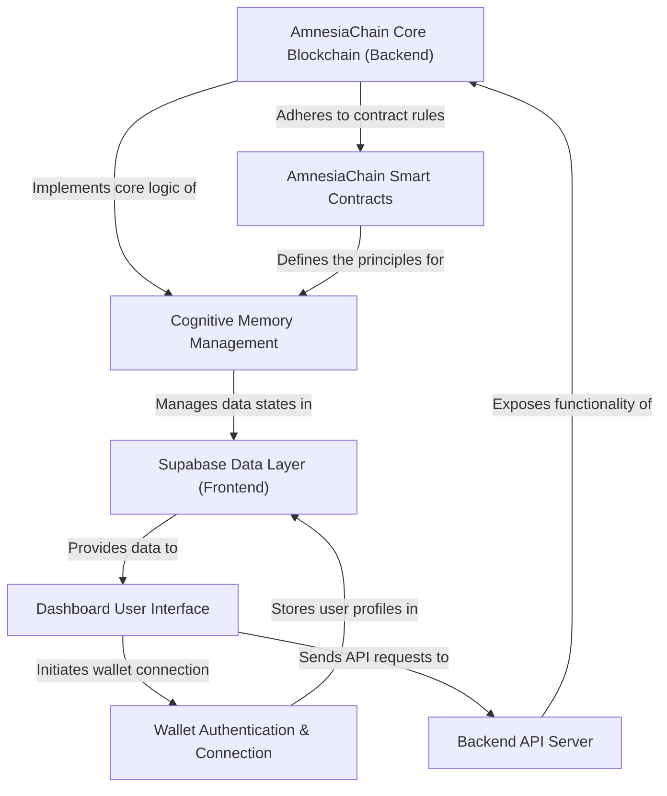
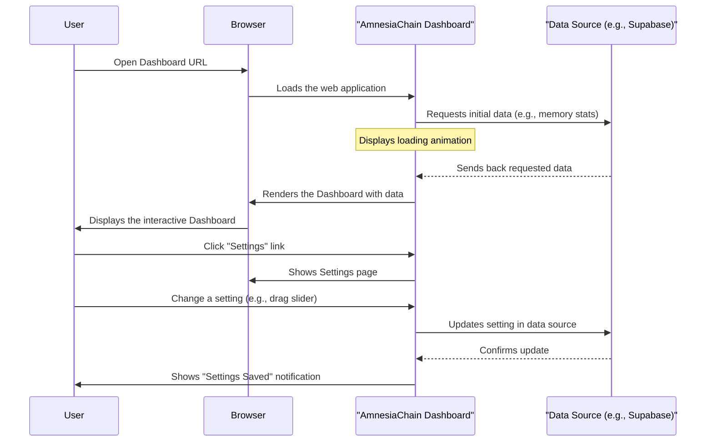
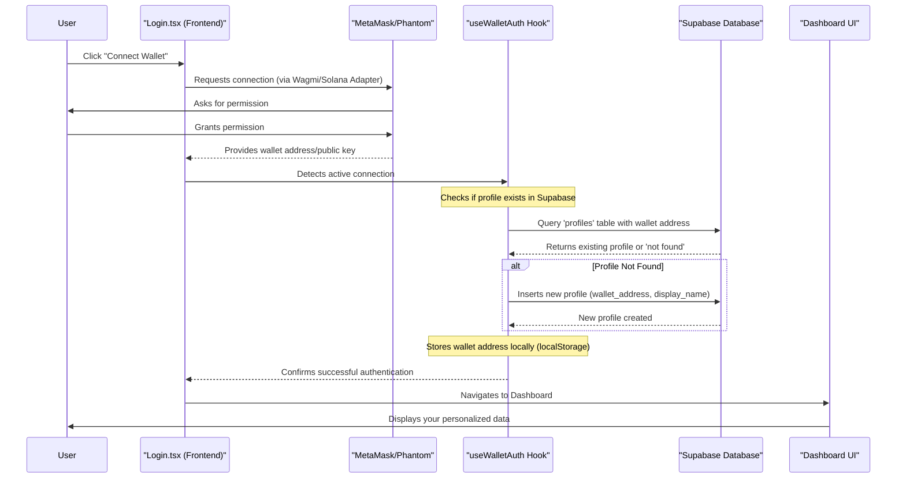
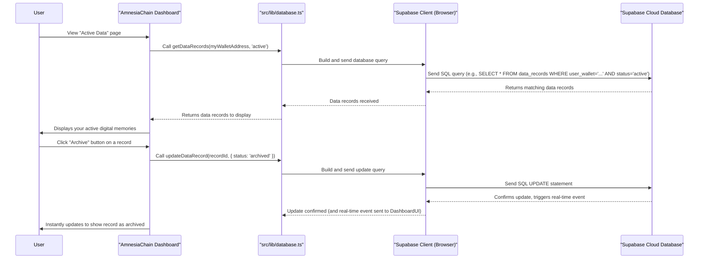
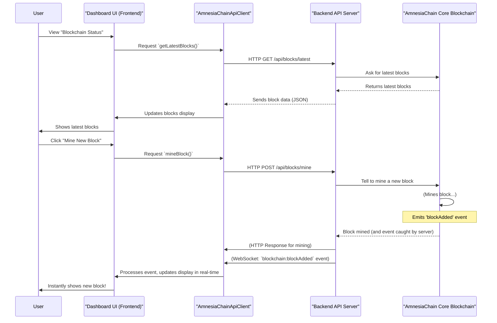
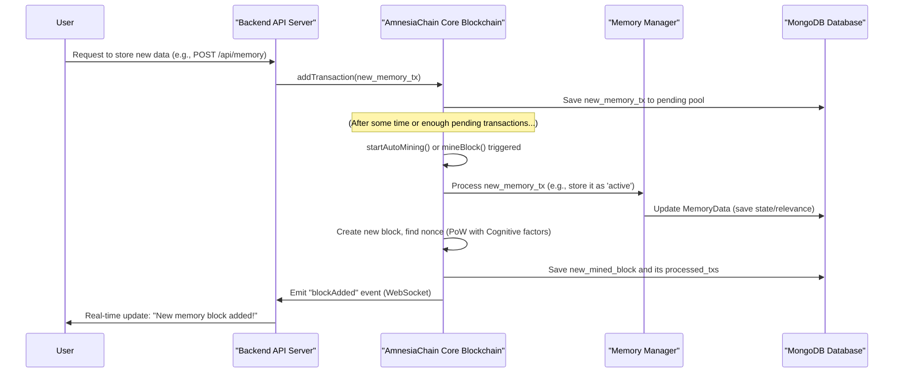
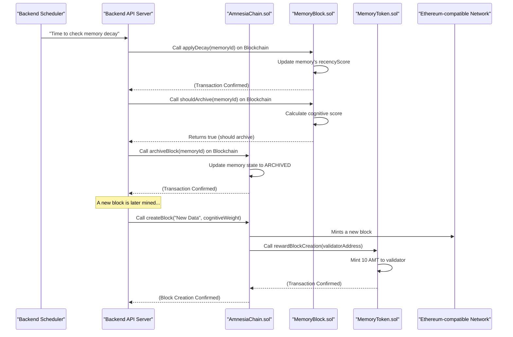
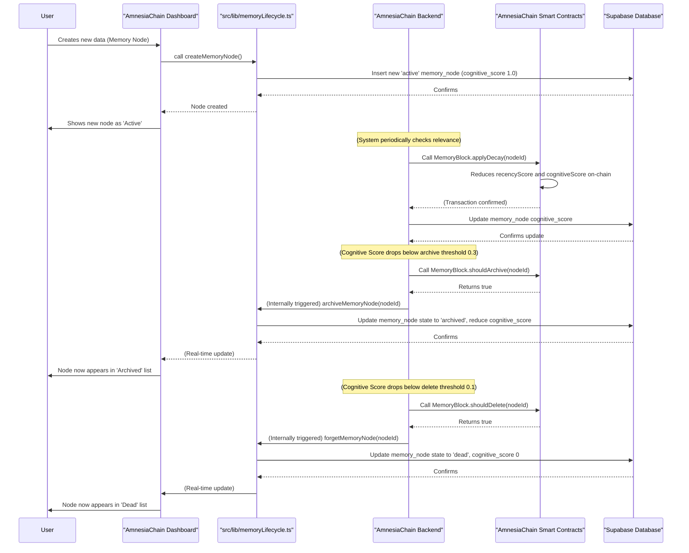

# Tutorial: AmnesiaChain

AmnesiaChain is a **decentralized memory management system** that leverages a *custom blockchain* and `cognitive intelligence` to mimic how the human brain remembers and forgets. Users can **securely store, archive, and permanently forget their digital data** via an intuitive *dashboard*, optimizing storage based on data relevance and access patterns, with interactions managed through various secure and decentralized components.


## Visual Overview



## Chapters

1. [Dashboard User Interface
](01_dashboard_user_interface_.md)
2. [Wallet Authentication & Connection
](02_wallet_authentication___connection_.md)
3. [Supabase Data Layer (Frontend)
](03_supabase_data_layer__frontend__.md)
4. [Backend API Server
](04_backend_api_server_.md)
5. [AmnesiaChain Core Blockchain (Backend)
](05_amnesiachain_core_blockchain__backend__.md)
6. [AmnesiaChain Smart Contracts
](06_amnesiachain_smart_contracts_.md)
7. [Cognitive Memory Management
](07_cognitive_memory_management_.md)

---

# Chapter 1: Dashboard User Interface

Welcome to AmnesiaChain! Imagine your data as your digital memories. Just like your brain manages what you actively think about, what you store for later, and what you eventually forget, AmnesiaChain helps you manage your digital information. But how do you see and control these "digital memories"? That's where the **Dashboard User Interface** comes in!

## What is the Dashboard User Interface?

Think of the Dashboard as your personal command center, a futuristic control panel for your AmnesiaChain data. It's the visual part of AmnesiaChain that you interact with directly through your web browser.

**The big problem it solves:** Without a dashboard, AmnesiaChain would be a powerful engine with no steering wheel or display. You wouldn't be able to see your data, understand its status, or make decisions about it.

**Your main use case:** You want to quickly check how much "active" data you have, see what's been "archived," or adjust how AmnesiaChain manages your data automatically. The Dashboard is built specifically for this!

## Key Concepts of Your Command Center

The AmnesiaChain Dashboard is designed to be intuitive and visually striking, using modern web technologies to give you real-time insights. Let's break down its core sections, like different screens on your command panel:

1.  **Overview**: This is your main status screen. It gives you a quick summary of everything happening in your AmnesiaChain memory.
2.  **Active Data**: This view shows all the data you're currently using, the digital memories your AmnesiaChain is actively processing or considering important.
3.  **Archived Data**: Here, you'll find data that's still important but not actively needed. It's like storing old photos in an album – you keep them, but don't look at them every day.
4.  **Dead Data**: This section lists data that AmnesiaChain has marked for deletion. It's the final stage before your digital memories are permanently "forgotten" from the chain.
5.  **Settings**: This is where you customize how AmnesiaChain behaves. You can set rules for archiving, deletion, and notifications, tailoring the system to your preferences.

The entire interface is built to be **responsive**, meaning it looks great and works smoothly whether you're on a large monitor, a tablet, or a phone. It also boasts an **aesthetically pleasing neon theme** with interactive charts and components, making your data management experience engaging.

## How to Interact with Your Dashboard

Using the Dashboard is like navigating a spaceship. You click on buttons, toggle switches, and view information presented in charts and lists.

For example, let's say your use case is: **"I want to adjust the automatic archiving settings for my data."**

Here's how you'd typically interact:

1.  **Access the Dashboard**: You open your web browser and go to the AmnesiaChain Dashboard URL.
2.  **Navigate to Settings**: On the left side, you'll see a navigation menu (the "Dashboard Sidebar"). You click on "Settings."
3.  **Adjust a Slider**: On the Settings page, you find a section for "Memory Management" and a slider labeled "Auto-Archive Delay." You drag the slider to increase or decrease the number of days before data is automatically archived.
4.  **Save Changes**: You click a "Save Settings" button at the bottom of the page.
5.  **Receive Feedback**: A small notification (a "toast" message) appears, confirming your settings have been saved.

This entire interaction is made possible by the Dashboard User Interface.

## Under the Hood: Building the Interface

The AmnesiaChain Dashboard isn't just a pretty face; it's a carefully constructed application using some of the most popular web development tools.

### The Technologies: React & TailwindCSS

*   **React**: This is like the skilled architect who designs the structure and functionality of your command center. React helps us build interactive pieces (like buttons, charts, and sliders) and ensures they respond quickly to your actions.
*   **TailwindCSS**: This is the interior designer who makes everything look good. TailwindCSS gives us a set of easy-to-use building blocks (like `bg-neon-blue` or `shadow-neon`) to create our unique neon, futuristic theme without writing a lot of traditional CSS code. It also makes the design responsive for all screen sizes.

### How it Works (A Simple Flow)

When you open your Dashboard, here’s a simplified look at what happens:


*Note: This diagram simplifies the backend interaction; actual data fetching involves more complex steps which we'll cover in future chapters like [Supabase Data Layer (Frontend)](03_supabase_data_layer__frontend__.md) and [Backend API Server](04_backend_api_server_.md).*

### Bringing the Design to Life: Code Examples

Let's look at some simplified code snippets that give the Dashboard its look and feel.

#### 1. Styling with TailwindCSS and Neon Colors

Our `tailwind.config.ts` file is where we define custom colors and styles, including our vibrant neon theme:

```typescript
// --- File: tailwind.config.ts ---
import type { Config } from "tailwindcss";

export default {
  // ... other config ...
  theme: {
    extend: {
      colors: {
        // Neon accent colors for futuristic design
        "neon-blue": "hsl(var(--neon-blue))",
        "neon-purple": "hsl(var(--neon-purple))",
        "neon-green": "hsl(var(--neon-green))",
        "neon-cyan": "hsl(var(--neon-cyan))",
        // Glass morphism
        glass: "hsl(var(--glass))",
        "glass-border": "hsl(var(--glass-border))",
        card: {
          DEFAULT: "hsl(var(--card))",
          foreground: "hsl(var(--card-foreground))",
          glass: "hsl(var(--card-glass))", // A special glass card background
        },
      },
      boxShadow: {
        "neon": "0 0 20px hsl(var(--primary) / 0.5)", // Custom neon shadow
      },
    },
  },
  // ... other config ...
} satisfies Config;
```
This code snippet shows how we define our custom colors like `neon-blue` and a `neon` shadow. These aren't just names; they refer to CSS variables that hold specific color values, allowing us to easily apply our theme throughout the entire application. TailwindCSS then generates helper classes like `text-neon-blue` or `shadow-neon` for us to use directly in our HTML.

These colors are then defined in our global CSS file, `src/index.css`:

```css
/* --- File: src/index.css --- */
@layer base {
  :root { /* Light mode variables */
    --background: 0 0% 100%;
    --neon-blue: 214 100% 50%;
    --card-glass: 240 10% 3.9% / 0.03; /* Semi-transparent dark for glass effect */
  }

  .dark { /* Dark mode variables (default for AmnesiaChain) */
    --background: 240 10% 3.9%; /* Dark background */
    --neon-blue: 214 100% 60%; /* Brighter neon blue for dark mode */
    --card-glass: 0 0% 100% / 0.03; /* Semi-transparent white for glass effect */
  }
}

@layer utilities {
  .text-neon-blue { color: hsl(var(--neon-blue)); }
  .bg-card-glass {
    background: rgba(255, 255, 255, 0.03); /* Light mode fallback */
    backdrop-filter: blur(20px);
    border: 1px solid rgba(255, 255, 255, 0.05);
  }
  .dark .bg-card-glass { /* Dark mode glass effect */
    background: rgba(0, 0, 0, 0.3);
    backdrop-filter: blur(20px);
    border: 1px solid rgba(255, 255, 255, 0.1);
  }
}
```
Here, we define the actual color values for light and dark modes. Notice how `--neon-blue` is slightly different in `dark` mode to stand out more. We also create a `.bg-card-glass` utility that uses a semi-transparent background and a `backdrop-filter: blur()` effect to create the "glass morphism" look, often seen in futuristic UIs.

#### 2. Structuring the Dashboard Pages

The `src/pages/Dashboard.tsx` file acts as the main container for all your dashboard views. It handles which specific page (Overview, Settings, etc.) is shown based on the web address.

```typescript
// --- File: src/pages/Dashboard.tsx ---
import { Routes, Route } from 'react-router-dom';
import DashboardOverview from '@/pages/dashboard/Overview';
import DashboardSettings from '@/pages/dashboard/Settings';
// ... other imports for Active, Archived, Dead pages

const Dashboard = () => {
  // ... authentication logic ...

  return (
    <div className="min-h-screen flex w-full bg-background">
      {/* DashboardSidebar for navigation */}
      <DashboardSidebar />
      <div className="flex-1 flex flex-col min-w-0">
        {/* DashboardHeader for search, wallet, notifications */}
        <DashboardHeader />
        <main className="flex-1 overflow-auto">
          <div className="container mx-auto p-4 md:p-6 max-w-7xl">
            <Routes>
              <Route path="/" element={<DashboardOverview />} />
              <Route path="/active" element={<DashboardActive />} />
              <Route path="/archived" element={<DashboardArchived />} />
              <Route path="/dead" element={<DashboardDead />} />
              <Route path="/settings" element={<DashboardSettings />} />
            </Routes>
          </div>
        </main>
      </div>
    </div>
  );
};

export default Dashboard;
```
This snippet shows how `react-router-dom` is used. Each `<Route>` component links a specific URL path (like `/dashboard/settings`) to a corresponding React component (like `<DashboardSettings />`), allowing you to seamlessly switch between different sections of your Dashboard. The `DashboardSidebar` and `DashboardHeader` are persistent elements that stay on screen regardless of which page you're viewing.

#### 3. The Settings Page Example

Let's look at a tiny part of the `src/pages/dashboard/Settings.tsx` to see how interactive components are used.

```typescript
// --- File: src/pages/dashboard/Settings.tsx ---
import { useState } from 'react';
import { Label } from '@/components/ui/label';
import { Slider } from '@/components/ui/slider';
import { Switch } from '@/components/ui/switch';

const DashboardSettings = () => {
  const [relevanceThreshold, setRelevanceThreshold] = useState([75]);
  const [autoArchive, setAutoArchive] = useState(true); // Example for a switch

  return (
    <div className="space-y-6">
      <h1 className="text-3xl font-bold text-foreground">Settings</h1>
      
      <div className="space-y-3">
        <Label>Relevance Score Threshold</Label>
        <Slider
          value={relevanceThreshold}
          onValueChange={setRelevanceThreshold}
          max={100}
          min={10}
          step={5}
        />
        <p className="text-xs text-muted-foreground">
          Current: {relevanceThreshold[0]}%
        </p>
      </div>
      
      <div className="flex items-center justify-between">
        <Label>Auto-Archive</Label>
        <Switch 
          checked={autoArchive} 
          onCheckedChange={setAutoArchive} 
        />
      </div>
      {/* ... more settings controls ... */}
    </div>
  );
};

export default DashboardSettings;
```
This simplified code snippet from the `Settings` page demonstrates basic React functionality. `useState` is used to manage the values of our interactive components, like the `Slider` (for "Relevance Score Threshold") and `Switch` (for "Auto-Archive"). When you interact with these elements, their state updates, and the UI reflects those changes immediately, providing a real-time control experience.

#### 4. Visualizing Data with Charts

The `src/components/DataLifecycleChart.tsx` is an example of how we visualize complex data.

```typescript
// --- File: src/components/DataLifecycleChart.tsx ---
import { PieChart, Pie, Cell, ResponsiveContainer } from 'recharts';
import { Card, CardContent, CardTitle } from '@/components/ui/card';

const COLORS = {
  active: '#00d4ff', // neon-blue
  archived: '#00ff88', // neon-green  
  dead: '#b347ff', // neon-purple
};

export function DataLifecycleChart() {
  const memoryData = [ // Example data, usually from a data source
    { name: 'Active', value: 300, color: COLORS.active },
    { name: 'Archived', value: 150, color: COLORS.archived },
    { name: 'Dead', value: 50, color: COLORS.dead },
  ];

  return (
    <Card className="bg-card-glass backdrop-blur-md border-glass-border">
      <CardTitle className="p-4">Data Distribution</CardTitle>
      <CardContent>
        <ResponsiveContainer width="100%" height={250}>
          <PieChart>
            <Pie
              data={memoryData}
              cx="50%" cy="50%" outerRadius={90}
              dataKey="value"
            >
              {memoryData.map((entry, index) => (
                <Cell key={`cell-${index}`} fill={entry.color} />
              ))}
            </Pie>
          </PieChart>
        </ResponsiveContainer>
      </CardContent>
    </Card>
  );
}
```
This component uses the `recharts` library to draw a `PieChart`. It takes `memoryData` (which would come from your actual AmnesiaChain data) and displays the distribution of "Active," "Archived," and "Dead" data. Each slice of the pie uses our defined `COLORS` (neon-blue, neon-green, neon-purple) to maintain the consistent theme. This provides an immediate, visual understanding of your data's lifecycle.

## Conclusion

The Dashboard User Interface is your window into AmnesiaChain. It's built with React for dynamic interaction and styled with TailwindCSS for a slick, responsive, neon-themed experience. Through different views like Overview, Active, Archived, Dead, and Settings, it empowers you to visualize and control your digital memories effectively.

Now that you understand *what* the Dashboard is and *how* it's presented to you, the next logical step is to understand how you gain access to it. In the next chapter, we'll dive into the crucial process of connecting your digital identity to AmnesiaChain.

[Next Chapter: Wallet Authentication & Connection](02_wallet_authentication___connection_.md)

---

# Chapter 2: Wallet Authentication & Connection

In the previous chapter, we explored the [Dashboard User Interface](01_dashboard_user_interface_.md) – your personal command center for AmnesiaChain. You learned how to navigate through your digital memories, visualize data, and adjust settings. But before you can *do* any of that, AmnesiaChain needs to know who you are! How do you securely "log in" and prove your identity in a blockchain application?

This is where **Wallet Authentication & Connection** comes in.

## What is Wallet Authentication & Connection?

Imagine you're entering a secure, futuristic digital space where your unique identity isn't a username and password, but your cryptocurrency wallet. **Wallet Authentication & Connection** is the system that lets you securely link that digital identity (your wallet) to the AmnesiaChain application.

**The big problem it solves:** Traditional websites ask for your email and a password. In the world of blockchain, your wallet is your passport. This abstraction provides a secure, decentralized way for AmnesiaChain to recognize *you* without ever needing to know your private keys or traditional login details.

**Your main use case:** You want to quickly and securely log into AmnesiaChain to see and manage *your specific digital memories* on the dashboard. This system ensures that only you, with access to your wallet, can access your data.

## Key Concepts of Your Digital Identity

Let's break down the essential ideas behind connecting your wallet to AmnesiaChain.

### 1. Your Wallet: Your Digital Passport
Think of your cryptocurrency wallet (like MetaMask or Phantom) as your digital identity document. It doesn't hold your coins directly; instead, it holds the secret keys that control them. Each wallet also has a unique **public address** – this is like your digital passport number.

### 2. Wallet Address as Your Identity
When you connect your wallet to AmnesiaChain, we don't ask for a username. Instead, your wallet's public address becomes your unique identifier. AmnesiaChain uses this address to:
*   **Identify you**: It's how the system knows who you are.
*   **Retrieve your data**: All your data stored in AmnesiaChain (and our [Supabase Data Layer (Frontend)](03_supabase_data_layer__frontend__.md)) is linked to this specific address.
*   **Authorize actions**: Any commands you send to the blockchain (like updating data) will use this connected wallet for authorization.

### 3. Connection vs. Authentication
*   **Connection**: This is the first step, where your wallet application (e.g., MetaMask) establishes a link with AmnesiaChain. It essentially says, "I'm here, and this is my public address."
*   **Authentication**: While connection provides your address, true authentication often involves *signing a message* with your wallet to prove you *own* that address. For simplicity, AmnesiaChain uses the active connection of your wallet as the primary authentication step for accessing your data, streamlining the login process.

### 4. Multi-Chain Support
The blockchain world is diverse! AmnesiaChain is designed to be flexible and supports wallets from different blockchain networks:

| Feature                   | Ethereum Wallets (e.g., MetaMask) | Solana Wallets (e.g., Phantom) |
| :------------------------ | :-------------------------------- | :----------------------------- |
| **Blockchain Network**    | Ethereum (and compatible chains)  | Solana                         |
| **Technology Used**       | Wagmi (a popular React hook library) | Solana Wallet Adapter (React library) |
| **Typical Connection**    | Browser Extension / WalletConnect | Browser Extension              |
| **AmnesiaChain Use**      | Access data, interact with EVM smart contracts | Access data, interact with Solana smart contracts |

This means you can use your preferred wallet, whether it's on Ethereum or Solana, to interact with AmnesiaChain.

## How to Connect Your Wallet

Let's walk through the main use case: **"I want to securely log into AmnesiaChain and see *my* data on the dashboard."**

### User Interaction Flow:

1.  **Open AmnesiaChain**: You navigate to the AmnesiaChain web application in your browser.
2.  **Click "Connect Wallet"**: You'll typically be greeted by a login screen with options to connect your wallet.
3.  **Choose Your Wallet Type**: You select if you want to connect an Ethereum wallet (like MetaMask) or a Solana wallet (like Phantom).
4.  **Approve Connection**: Your chosen wallet extension (e.g., MetaMask pop-up or Phantom window) will ask for your permission to connect to AmnesiaChain. You click "Connect" or "Approve."
5.  **Access Dashboard**: Once approved, AmnesiaChain receives your wallet address, logs you in, and redirects you to *your* personalized [Dashboard User Interface](01_dashboard_user_interface_.md).

### Code in Action: The Login Screen

The `src/pages/Login.tsx` file handles the visual part of connecting your wallet.

```typescript
// --- File: src/pages/Login.tsx (Simplified) ---
import { useEffect, useState } from 'react';
import { useNavigate } from 'react-router-dom';
import { useConnect, useAccount } from 'wagmi'; // For Ethereum wallets
import { useWallet } from '@solana/wallet-adapter-react'; // For Solana wallets
import { useWalletModal } from '@solana/wallet-adapter-react-ui';

const Login = () => {
  const navigate = useNavigate();
  const { connect, connectors } = useConnect(); // Wagmi hook for Ethereum
  const { address, isConnected } = useAccount(); // Wagmi hook to get Ethereum address

  const { connected: solanaConnected, publicKey } = useWallet(); // Solana hook
  const { setVisible } = useWalletModal(); // Solana modal for Phantom

  // This effect runs whenever wallet connection status changes
  useEffect(() => {
    const handleWalletConnection = () => {
      // If an Ethereum wallet is connected...
      if (isConnected && address) {
        console.log("Ethereum wallet connected:", address);
        setTimeout(() => navigate('/dashboard'), 500); // Go to dashboard!
      } 
      // Or if a Solana wallet is connected...
      else if (solanaConnected && publicKey) {
        console.log("Solana wallet connected:", publicKey.toString());
        setTimeout(() => navigate('/dashboard'), 500); // Go to dashboard!
      }
    };
    handleWalletConnection();
  }, [isConnected, address, solanaConnected, publicKey, navigate]); // Dependencies

  // Function to connect Ethereum wallet
  const handleConnect = async (connector: any) => {
    try {
      await connect({ connector }); // Connects using Wagmi
    } catch (error) {
      console.error("Ethereum connection failed", error);
    }
  };

  // Function to connect Solana wallet
  const handleSolanaConnect = () => {
    try {
      setVisible(true); // Opens the Solana wallet connection modal
    } catch (error) {
      console.error("Solana connection failed", error);
    }
  };

  return (
    <div /* ... UI elements for login screen ... */ >
      {/* Buttons for Ethereum wallets */}
      {connectors.map((connector, index) => (
        <button key={connector.uid} onClick={() => handleConnect(connector)}>
          Connect with {connector.name} (Ethereum)
        </button>
      ))}

      {/* Button for Solana wallet */}
      <button onClick={handleSolanaConnect}>
        Connect with Phantom (Solana)
      </button>
    </div>
  );
};

export default Login;
```
This simplified `Login.tsx` file shows how the `useEffect` hook monitors the connection status of both Ethereum (`isConnected`, `address`) and Solana (`solanaConnected`, `publicKey`) wallets. As soon as a connection is detected, the user is automatically redirected to the `/dashboard` page. The `handleConnect` and `handleSolanaConnect` functions trigger the actual wallet connection process when buttons are clicked.

## Under the Hood: How AmnesiaChain Recognizes You

Let's peek behind the curtain to see what happens when you connect your wallet.

### Step-by-Step Flow: Your Digital Journey



### The Wiring: Integrating Wallets

AmnesiaChain uses specific libraries to talk to different blockchain wallets.

#### 1. Ethereum Wallets with Wagmi

The `src/lib/wagmi.ts` file sets up how AmnesiaChain connects to Ethereum-compatible wallets.

```typescript
// --- File: src/lib/wagmi.ts (Simplified) ---
import { createConfig, http } from 'wagmi';
import { mainnet, sepolia } from 'wagmi/chains';
import { metaMask, walletConnect, injected } from 'wagmi/connectors';

const projectId = import.meta.env.VITE_WALLETCONNECT_PROJECT_ID || 'amnesiachain-demo-project';

export const config = createConfig({
  chains: [mainnet, sepolia], // Supports Ethereum Mainnet and Sepolia testnet
  connectors: [
    metaMask(), // MetaMask browser extension
    walletConnect({ projectId }), // WalletConnect for mobile apps
    injected(), // Generic injected wallet (e.g., Brave Wallet)
  ],
  transports: {
    [mainnet.id]: http(),
    [sepolia.id]: http(),
  },
});
```
This configuration uses `wagmi` to define which Ethereum networks (chains) AmnesiaChain will interact with (like `mainnet` and `sepolia` for testing) and what wallet types it supports, such as `metaMask`, `walletConnect`, and other `injected` wallets. The `projectId` is important for WalletConnect to function correctly, ensuring secure pairing with mobile wallets.

#### 2. Solana Wallets with Solana Wallet Adapter

The `src/lib/solana.ts` file configures the connection for Solana wallets, primarily Phantom.

```typescript
// --- File: src/lib/solana.ts (Simplified) ---
import { ConnectionProvider, WalletProvider } from '@solana/wallet-adapter-react';
import { WalletAdapterNetwork } from '@solana/wallet-adapter-base';
import { PhantomWalletAdapter } from '@solana/wallet-adapter-phantom';
import { clusterApiUrl } from '@solana/web3.js';
import { useMemo } from 'react';

export const useSolanaConfig = () => {
  const network = WalletAdapterNetwork.Devnet; // Using Devnet for development
  const endpoint = useMemo(() => clusterApiUrl(network), [network]);
  
  const wallets = useMemo(
    () => [
      new PhantomWalletAdapter(), // Only Phantom for now
    ],
    []
  );

  return {
    endpoint, // Where to connect on the Solana network
    wallets,  // List of supported Solana wallets
    network
  };
};
```
This snippet shows how AmnesiaChain prepares to connect to the Solana blockchain. It specifies the `Devnet` (a testing network) and includes the `PhantomWalletAdapter`, which is the code needed to communicate with the Phantom wallet browser extension. The `ConnectionProvider` and `WalletProvider` (used in `src/components/SolanaWalletProvider.tsx`) then use this configuration to make Solana wallets available throughout the application.

#### 3. The `useWalletAuth` Hook: Your Identity Manager

The `src/hooks/useWalletAuth.ts` file is the core intelligence behind wallet authentication.

```typescript
// --- File: src/hooks/useWalletAuth.ts (Simplified) ---
import { useState, useEffect } from 'react';
import { useAccount } from 'wagmi'; // For Ethereum
import { useWallet } from '@solana/wallet-adapter-react'; // For Solana
import { supabase } from '@/integrations/supabase/client'; // Our database client

export const useWalletAuth = () => {
  const [isAuthenticated, setIsAuthenticated] = useState(false);
  const [walletAddress, setWalletAddress] = useState<string | null>(null);

  // Get Ethereum wallet status
  const { address: ethAddress, isConnected: ethConnected } = useAccount();
  
  // Get Solana wallet status
  const { publicKey: solanaPublicKey, connected: solanaConnected } = useWallet();

  useEffect(() => {
    const registerWallet = async (address: string, chain: 'ethereum' | 'solana') => {
      // 1. Check if this wallet address already has a profile in our database
      const { data: existingProfile } = await supabase
        .from('profiles')
        .select('*')
        .eq('wallet_address', address)
        .maybeSingle();

      // 2. If not, create a new profile for them
      if (!existingProfile) {
        await supabase.from('profiles').insert({
          id: crypto.randomUUID(), // Generate a unique ID
          wallet_address: address,
          display_name: `${chain === 'ethereum' ? 'ETH' : 'SOL'} User ${address.slice(0, 6)}`,
        });
      }

      // 3. Update our application's state and store in local storage
      setWalletAddress(address);
      setIsAuthenticated(true);
      localStorage.setItem('wallet_auth', JSON.stringify({ address, chain }));
    };

    // Prioritize checking if a wallet is connected
    if (ethConnected && ethAddress) {
      registerWallet(ethAddress, 'ethereum');
    } else if (solanaConnected && solanaPublicKey) {
      registerWallet(solanaPublicKey.toString(), 'solana');
    } else {
      // If no wallet is connected, check local storage for a previously saved session
      const storedAuth = localStorage.getItem('wallet_auth');
      if (storedAuth) {
        const { address, chain } = JSON.parse(storedAuth);
        setWalletAddress(address);
        setIsAuthenticated(true);
      } else {
        setIsAuthenticated(false);
      }
    }
  }, [ethConnected, ethAddress, solanaConnected, solanaPublicKey]); // Rerun when connection status changes

  return { isAuthenticated, walletAddress };
};
```
This `useWalletAuth` hook is central to AmnesiaChain's authentication. It continuously checks if an Ethereum wallet (`ethConnected`, `ethAddress`) or a Solana wallet (`solanaConnected`, `solanaPublicKey`) is connected. When a connection is active, it calls `registerWallet`. This function is critical: it first queries our [Supabase Data Layer (Frontend)](03_supabase_data_layer__frontend__.md) (`profiles` table) to see if a user with that `wallet_address` already exists. If not, it creates a new entry, effectively "registering" the user's wallet as their identity within AmnesiaChain. Finally, it stores basic authentication information in `localStorage` so you stay logged in even if you refresh the page.

#### 4. The Supabase `profiles` Table

The database schema, particularly the `profiles` table defined in `supabase/migrations/...sql`, is where your wallet address is permanently recorded as your identity.

```sql
-- --- File: supabase/migrations/20251010174525_19809a44-165d-4687-b32b-33795421d082.sql (Simplified) ---
CREATE TABLE public.profiles (
  id UUID PRIMARY KEY REFERENCES auth.users(id) ON DELETE CASCADE,
  wallet_address TEXT UNIQUE, -- This is your unique digital identity
  display_name TEXT,
  created_at TIMESTAMP WITH TIME ZONE DEFAULT now() NOT NULL,
  updated_at TIMESTAMP WITH TIME ZONE DEFAULT now() NOT NULL
);

ALTER TABLE public.profiles ENABLE ROW LEVEL SECURITY;

CREATE POLICY "Users can view all profiles"
  ON public.profiles FOR SELECT
  USING (true);

CREATE POLICY "Users can update own profile"
  ON public.profiles FOR UPDATE
  USING (auth.uid() = id);

CREATE POLICY "Users can insert own profile"
  ON public.profiles FOR INSERT
  WITH CHECK (auth.uid() = id);
```
This SQL code shows the `profiles` table in our Supabase database. The `wallet_address` column is marked `UNIQUE`, ensuring that each wallet address can only have one profile, making it your definitive identity within AmnesiaChain. The `id` column links this profile to a user record in Supabase's `auth.users` table (though `useWalletAuth` currently manages a separate UUID for the `profiles` table, demonstrating the flexibility for wallet-first identities). Row Level Security (RLS) is enabled, which is crucial for data privacy, ensuring that users can only modify their *own* profiles.

## Conclusion

Wallet Authentication & Connection is your secure gateway to AmnesiaChain. It uses your cryptocurrency wallet as your digital identity, supporting both Ethereum and Solana ecosystems. By leveraging libraries like Wagmi and Solana Wallet Adapter, AmnesiaChain connects to your wallet, registers your unique address in its database, and then grants you access to your personalized [Dashboard User Interface](01_dashboard_user_interface_.md). This method ensures that your data remains linked to you, without ever compromising your private keys.

Now that you understand how to securely identify yourself to AmnesiaChain, the next question is: *where* does AmnesiaChain store your data, and how does the application interact with it? In the next chapter, we'll explore the [Supabase Data Layer (Frontend)](03_supabase_data_layer__frontend__.md) to see how your digital memories are managed.

[Next Chapter: Supabase Data Layer (Frontend)](03_supabase_data_layer__frontend__.md)

---

# Chapter 3: Supabase Data Layer (Frontend)

In the last chapter, we learned how [Wallet Authentication & Connection](02_wallet_authentication___connection_.md) securely identifies you to AmnesiaChain using your digital wallet. You now know *who you are* to the application. But once AmnesiaChain knows you, *where* does it keep all your important digital memories? And how does your [Dashboard User Interface](01_dashboard_user_interface_.md) actually get and display *your specific* data?

This is where the **Supabase Data Layer (Frontend)** comes into play!

## What is the Supabase Data Layer (Frontend)?

Imagine you have a super-organized digital filing cabinet in the cloud. This cabinet stores all your important documents, photos, and notes. When you need something, you just ask for it, and it appears almost instantly on your screen. When you save or change something, it's updated in the cabinet securely.

**Supabase** is that powerful, cloud-based digital filing cabinet for AmnesiaChain. It's the primary place where your frontend application stores and retrieves all your critical user information and data records.

**The big problem it solves:** Without Supabase, AmnesiaChain wouldn't have a reliable, scalable, and secure place to store user-specific data like your profile, your actual data records, or your activity history. It's the central hub for all your "digital memories."

**Your main use case:** You want to quickly check all your data records (active, archived, dead) on your dashboard, see their details, and be sure they are stored safely and linked only to your wallet address.

## Key Concepts of Your Digital Filing Cabinet

Let's break down how Supabase helps AmnesiaChain manage your digital memories.

### 1. Cloud Database
Supabase provides a powerful **PostgreSQL database** that lives in the cloud. This means your data isn't stored directly on your computer, but on secure servers accessible over the internet. This allows AmnesiaChain to manage vast amounts of data efficiently and reliably.

### 2. Backend-as-a-Service (BaaS)
Supabase is more than just a database. It's a "Backend-as-a-Service." Think of it as a full suite of tools that takes care of many common backend tasks for AmnesiaChain, such as:
*   **Database:** Storing all your data.
*   **Authentication:** Helping to manage user identities (even though we use wallets, Supabase can link to them).
*   **Real-time Subscriptions:** Allowing your dashboard to update instantly when data changes.
*   **Serverless Functions:** Running small, specialized programs in the cloud (like uploading data to IPFS).

### 3. User Profiles & Wallet Addresses
When you connect your wallet (as discussed in Chapter 2), Supabase stores your **user profile**, which is directly linked to your unique **wallet address**. This ensures that all the data you see and interact with is uniquely yours. It's how AmnesiaChain personalizes your experience.

### 4. Data Records & Memory State
Your actual "digital memories" are stored as **data records** in Supabase. Each record has a specific **memory state**:
*   **Active:** Data you're currently using.
*   **Archived:** Data you've stored for later.
*   **Dead:** Data marked for deletion.

Supabase keeps track of these states, allowing your dashboard to categorize and display your data appropriately.

### 5. Activity Logs & Transactions
Supabase also acts as a digital diary, storing:
*   **Activity Logs:** A history of your actions within AmnesiaChain (e.g., "archived a document," "created new data").
*   **Transactions:** Records of important blockchain interactions related to your data.

This gives you a clear audit trail of your digital memory management.

### 6. Real-time Updates
One of Supabase's coolest features is its **real-time capabilities**. Imagine you make a change to your data on one device, and it instantly updates on your dashboard on another device, or even on a friend's screen if they're looking at shared data. Supabase makes this live synchronization easy.

### 7. Edge Functions for Specialized Tasks
Supabase can host small, serverless programs called **Edge Functions**. These functions run "at the edge" of the network, meaning they are geographically close to where they are used, making them very fast. AmnesiaChain uses these for specific tasks, like uploading your data securely to IPFS (InterPlanetary File System), which is a decentralized storage network.

## How to Use Supabase: Getting Your Data on the Dashboard

Let's focus on our main use case: **"I want to see all my data records (active, archived, dead) on the dashboard and update them, knowing they are saved securely."**

When you open the AmnesiaChain Dashboard after connecting your wallet, the application immediately starts fetching your data from Supabase.

### 1. Fetching Your Data Records
The dashboard needs to get a list of your digital memories to display them. This is done using helper functions that interact with Supabase.

In AmnesiaChain, we have a file called `src/lib/database.ts` which contains functions to talk to Supabase. One important function is `getDataRecords`.

```typescript
// --- File: src/lib/database.ts (Simplified) ---
import { supabase } from './supabase'; // Our Supabase client
import { DataRecord } from './supabase'; // Data type definitions

// ... other functions ...

export const getDataRecords = async (
  walletAddress: string,
  status?: 'active' | 'archived' | 'dead' // Optional filter for status
): Promise<DataRecord[]> => {
  let query = supabase
    .from('data_records') // We want data from the 'data_records' table
    .select('*')          // Get all columns
    .eq('user_wallet', walletAddress) // ONLY get data for *this* wallet
    .order('created_at', { ascending: false }); // Sort by creation date

  if (status) {
    query = query.eq('status', status); // If a status is given, filter by it
  }

  const { data, error } = await query; // Run the query!

  if (error) {
    console.error('Error fetching data records:', error);
    return []; // Return an empty list if there's an error
  }

  return data || []; // Return the data (or empty if none)
};
```
This `getDataRecords` function is like asking the Supabase filing cabinet: "Show me all the records that belong to *this specific wallet address*." You can even ask for records with a specific `status`, like "only active records."

**Example of calling this function in your frontend:**

```typescript
// Somewhere in your Dashboard component (e.g., ActiveData.tsx)
import { useState, useEffect } from 'react';
import { useWalletAuth } from '@/hooks/useWalletAuth'; // From Chapter 2
import { getDataRecords, DataRecord } from '@/lib/database';

const ActiveDataPage = () => {
  const { walletAddress } = useWalletAuth(); // Get current user's wallet
  const [activeRecords, setActiveRecords] = useState<DataRecord[]>([]);
  const [isLoading, setIsLoading] = useState(true);

  useEffect(() => {
    const fetchRecords = async () => {
      if (walletAddress) { // Only fetch if we know who the user is
        setIsLoading(true);
        const records = await getDataRecords(walletAddress, 'active'); // Fetch active data
        setActiveRecords(records);
        setIsLoading(false);
      }
    };
    fetchRecords();
  }, [walletAddress]); // Re-run if walletAddress changes

  if (isLoading) return <p>Loading your active memories...</p>;
  if (activeRecords.length === 0) return <p>No active memories found.</p>;

  return (
    <div>
      <h2 className="text-2xl font-bold mb-4">Your Active Digital Memories</h2>
      {activeRecords.map(record => (
        <div key={record.id} className="bg-card-glass p-4 rounded-lg mb-2">
          <p>Hash: {record.data_hash.slice(0, 10)}...</p>
          <p>Type: {record.data_type}</p>
          <p>Relevance: {record.relevance_score * 100}%</p>
          {/* ... more record details ... */}
        </div>
      ))}
    </div>
  );
};

export default ActiveDataPage;
```
In this simplified example, the `ActiveDataPage` component uses `getDataRecords` to fetch only the `'active'` data records for the currently connected user's `walletAddress`. When the data comes back, it's displayed on the screen. This is how your dashboard shows you *your* specific digital memories!

### 2. Updating Your Data Records
What if you want to change the status of a data record, for example, move it from 'active' to 'archived'? You'd use another function, `updateDataRecord`.

```typescript
// --- File: src/lib/database.ts (Simplified) ---
// ... other functions ...

export const updateDataRecord = async (
  id: string, // The unique ID of the record to update
  updates: Partial<DataRecord> // The changes you want to make
): Promise<DataRecord | null> => {
  const { data, error } = await supabase
    .from('data_records')
    .update({ ...updates, updated_at: new Date().toISOString() }) // Apply updates, and set 'updated_at'
    .eq('id', id) // Make sure we update the correct record
    .select()    // Return the updated record
    .single();   // Expect a single record back

  if (error) {
    console.error('Error updating data record:', error);
    return null;
  }

  return data;
};
```
If you call `updateDataRecord('some-uuid-123', { status: 'archived' })`, AmnesiaChain tells Supabase to find the record with that ID and change its `status` to `'archived'`. Supabase handles the change, and thanks to real-time features, your dashboard would update almost instantly to reflect this change!

## Under the Hood: How AmnesiaChain Uses Supabase

Let's peek behind the scenes to understand how Supabase is integrated into AmnesiaChain.

### Step-by-Step Flow: Getting Data to Your Dashboard



### 1. Connecting to Supabase: The Client
The `src/integrations/supabase/client.ts` file is where AmnesiaChain first establishes its connection to the Supabase cloud.

```typescript
// --- File: src/integrations/supabase/client.ts (Simplified) ---
import { createClient } from '@supabase/supabase-js';
import type { Database } from './types'; // Database schema types

const SUPABASE_URL = "https://your-project-id.supabase.co"; // Your unique Supabase URL
const SUPABASE_PUBLISHABLE_KEY = "your-anon-key"; // Your public API key

export const supabase = createClient<Database>(SUPABASE_URL, SUPABASE_PUBLISHABLE_KEY, {
  auth: {
    storage: localStorage, // Store session in browser's local storage
    persistSession: true,  // Keep user logged in
    autoRefreshToken: true, // Automatically renew login tokens
  }
});
```
This code creates a `supabase` object. This object is the main "doorway" for the AmnesiaChain frontend to send requests to the Supabase cloud database. It uses your unique project URL and a special "publishable key" to identify your AmnesiaChain project.

### 2. Defining Your Data Structure: The Database Schema
Before Supabase can store any data, it needs to know *what kind* of data to expect. This is defined in the **database schema**, which specifies the tables and columns. In AmnesiaChain, these definitions are in SQL files like `create-database-schema.sql`.

Here's a simplified look at some key tables:

| Table Name        | Description                                                                 | Key Information Stored                                                               |
| :---------------- | :-------------------------------------------------------------------------- | :----------------------------------------------------------------------------------- |
| `user_profiles`   | Stores general information about AmnesiaChain users.                        | `wallet_address` (unique ID), `chain_type`, `preferences`, stats.                    |
| `data_records`    | Stores metadata for each "digital memory" (e.g., a file, a piece of data). | `user_wallet`, `data_hash`, `data_type`, `size_bytes`, `status` (`active`, `archived`, `dead`), `relevance_score`, `metadata`. |
| `activity_logs`   | Records every important action a user performs.                             | `user_wallet`, `action`, `description`, `data_id` (linked to `data_records`).        |
| `transactions`    | Stores details about blockchain transactions related to data.               | `user_wallet`, `data_id`, `transaction_type`, `transaction_hash`, `gas_used`.      |

The `data_records` table is central to your digital memories. Here's a tiny part of its definition:

```sql
-- --- File: create-database-schema.sql (Simplified) ---
CREATE TABLE IF NOT EXISTS data_records (
    id UUID PRIMARY KEY DEFAULT gen_random_uuid(), -- Unique ID for each record
    user_wallet TEXT NOT NULL,                     -- Links to the user's wallet (FK)
    data_hash TEXT NOT NULL,                       -- A unique identifier for the actual data content
    data_type TEXT NOT NULL,                       -- e.g., 'document', 'image', 'video'
    size_bytes BIGINT NOT NULL,                    -- How big is the data
    status TEXT NOT NULL CHECK (status IN ('active', 'archived', 'dead')), -- Its current memory state
    relevance_score NUMERIC NOT NULL,              -- How important it is (0 to 1)
    metadata JSONB DEFAULT '{}',                   -- Flexible storage for extra info
    
    -- ... other columns and constraints ...
    FOREIGN KEY (user_wallet) REFERENCES user_profiles(wallet_address) ON DELETE CASCADE
);
```
This SQL code defines the structure for `data_records`. Notice `user_wallet` links it to `user_profiles`, and `status` ensures data can only be in specific states, just like your brain manages memories.

### 3. Database Operations: `src/lib/database.ts` Helpers
The `src/lib/database.ts` file acts as a friendly wrapper around the raw Supabase client. It provides simpler functions like `getDataRecords` and `updateDataRecord` that your dashboard components can easily use. This keeps the database interaction logic in one place, making your frontend code cleaner and easier to manage.

For example, the `getUserStats` function, used to populate the overview dashboard, leverages a PostgreSQL function defined directly in Supabase:

```typescript
// --- File: src/lib/database.ts (Simplified) ---
// ... imports ...

export const getUserStats = async (walletAddress: string) => {
  try {
    const { data, error } = await supabase
      .rpc('get_user_stats', { wallet_addr: walletAddress }); // Call a Supabase database function

    if (error) {
      console.error('Error fetching user stats:', error);
      // ... return default stats ...
    }
    // ... process and return data ...
  } catch (err) {
    console.error('Exception in getUserStats:', err);
    // ... return default stats ...
  }
};
```
The `.rpc('get_user_stats', { wallet_addr: walletAddress })` part tells Supabase to run a special function, `get_user_stats`, which calculates things like your total active data, archived data, and storage saved directly within the database. This is a powerful way to get complex statistics efficiently.

### 4. Supabase Edge Functions: Uploading to IPFS
Remember the "Edge Functions" concept? AmnesiaChain uses one to handle uploading data to IPFS (a decentralized storage system). This function is located in `supabase/functions/upload-to-ipfs/index.ts`.

```typescript
// --- File: supabase/functions/upload-to-ipfs/index.ts (Simplified) ---
import { createClient } from 'https://esm.sh/@supabase/supabase-js@2.75.0';
// ... other imports ...

Deno.serve(async (req) => {
  // ... CORS handling ...
  try {
    // 1. Get environment variables (Supabase URL, API Key, Pinata JWT)
    // 2. Initialize Supabase client for backend use
    // 3. Parse request body to get nodeId, data, metadata
    // 4. Fetch memory node details from Supabase DB
    // 5. Prepare data for IPFS upload
    // 6. Send data to Pinata (an IPFS pinning service)
    const pinataResponse = await fetch('https://api.pinata.cloud/pinning/pinJSONToIPFS', { /* ... */ });
    // 7. Get IPFS hash and URL from Pinata response
    // 8. Update the memory_nodes table in Supabase with the new IPFS hash/URL
    // 9. Return success response
  } catch (error) {
    // ... error handling ...
  }
});
```
This Edge Function runs entirely in the Supabase cloud, separate from your frontend. When the AmnesiaChain frontend needs to upload data to IPFS, it sends a request to this Edge Function. The function then talks to the IPFS service (like Pinata) and updates the database with the resulting IPFS link. This keeps sensitive operations (like interacting with IPFS services) secure and off your user's browser.

## Conclusion

The Supabase Data Layer is the robust backbone of AmnesiaChain's frontend. It provides a secure, scalable, and real-time cloud database to store all your user profiles, data records, activity logs, and transaction details. By leveraging Supabase's comprehensive "Backend-as-a-Service" features, AmnesiaChain can efficiently manage your digital memories, deliver instant updates to your dashboard, and even run specialized tasks like uploading to IPFS through Edge Functions.

Now that you understand where your data lives and how the frontend interacts with it, you might be wondering about the more complex operations, especially those involving the blockchain itself. This leads us to our next chapter, where we'll explore the dedicated **Backend API Server** that handles interactions beyond what Supabase directly provides.

[Next Chapter: Backend API Server](04_backend_api_server_.md)

---

# Chapter 4: Backend API Server

In the previous chapter, we explored the [Supabase Data Layer (Frontend)](03_supabase_data_layer__frontend__.md), learning how your dashboard efficiently stores and retrieves your personal data records using a cloud database. Supabase is excellent for managing user-specific application data. But what about interacting with the core **blockchain** itself? How do you request the latest blocks, send new transactions to be added to the chain, or get real-time updates about mining activity?

This is where the **Backend API Server** steps in!

## What is the Backend API Server?

Imagine AmnesiaChain as a bustling city. Your dashboard (the frontend) is like your personal apartment, and Supabase is like the local library or post office for your personal documents. But there's a much larger, central **City Hall** that manages all the city-wide laws, records public events, and processes major decisions for everyone. This City Hall is our **Backend API Server**.

The **Backend API Server**, built using Node.js and Express, is the central communication hub that connects your friendly frontend application to the powerful, complex core blockchain logic of AmnesiaChain. It's the gatekeeper and translator, allowing your dashboard to talk to the blockchain.

**The big problem it solves:** The core blockchain logic is complex and needs to run on a powerful, always-on server, not directly in your web browser. Your frontend can't directly "mine a block" or "query the entire chain." The Backend API Server provides a simple, structured way for your dashboard to ask the blockchain for information and tell it to do things.

**Your main use case:** You want to see the latest blocks added to the AmnesiaChain, know how many transactions are waiting, and even trigger the system to mine a new block when you have pending data changes.

## Key Concepts of Your Blockchain Command Post

Let's break down the essential ideas behind AmnesiaChain's Backend API Server.

### 1. RESTful API
"RESTful API" sounds fancy, but think of it like ordering from a standardized menu at a restaurant.
*   You use specific "methods" (like `GET` to ask for data, `POST` to send new data, `PUT` to update, `DELETE` to remove).
*   You ask for specific "resources" (like `/blocks` for all blocks, or `/transactions` for all transactions).
*   The server gives you a standardized "response" (usually JSON data).

This organized way of asking for and sending data makes it easy for any application to interact with AmnesiaChain.

### 2. Node.js and Express
These are the technologies we use to build our server:
*   **Node.js**: This is like the fast, efficient chef in our kitchen. It's a JavaScript "runtime" that allows us to run JavaScript code outside of a web browser, building powerful servers.
*   **Express**: This is the kitchen manager, a popular "framework" for Node.js. It makes building web servers and defining API routes (our menu items) much easier and faster.

### 3. Communication Hub
The API server sits in the middle:
*   **Frontend <-> API Server:** Your dashboard sends requests to the API server.
*   **API Server <-> Blockchain Core:** The API server then translates these requests into commands for the core AmnesiaChain blockchain logic and sends back the results.

It's the essential middleman that ensures smooth communication.

### 4. WebSockets for Real-time Updates
Imagine you're watching a live news ticker. You don't have to keep refreshing the page; new headlines just appear as they happen. That's what **WebSockets** do!

While RESTful APIs are great for "request-response" (you ask, you get an answer), WebSockets create a persistent, open connection between your frontend and the server. This allows the server to *push* updates to your dashboard instantly, without you having to ask. It's perfect for showing new blocks as they are mined or new transactions as they are added to the chain.

## How to Use the Backend API Server: Seeing Live Blockchain Data

Let's look at our main use case: **"I want to see the latest blocks added to the AmnesiaChain and be instantly notified when a new block is mined."**

On your AmnesiaChain Dashboard, you'll see a section showing recent blockchain activity. This information comes directly from our Backend API Server.

Your frontend application uses a special tool, `AmnesiaChainApiClient`, to talk to this server. This client handles all the RESTful requests and WebSocket connections for you.

```typescript
// --- File: src/lib/api-client.ts (Simplified) ---
import { AmnesiaChainApiClient } from './api-client'; // Our API client
import { Block, BlockchainState } from './api-client'; // Data types

const apiClient = new AmnesiaChainApiClient('http://localhost:3001'); // Connects to the server

// Function to fetch and display the latest blocks
async function displayLatestBlocks() {
  try {
    const latestBlocks: Block[] = await apiClient.getLatestBlocks(5); // Get 5 latest blocks
    console.log('Latest Blocks:', latestBlocks.map(b => b.index));
    // Update your dashboard UI with these blocks
  } catch (error) {
    console.error('Failed to fetch latest blocks:', error);
  }
}

// Function to listen for new blocks in real-time
function setupRealtimeBlockUpdates() {
  apiClient.on('blockchain:blockAdded', (newBlock: Block) => {
    console.log('🎉 New Block Added in Real-time!', newBlock.index);
    // Add the newBlock to your dashboard's display
  });
  console.log('Listening for new blocks...');
}

// Call these functions when your dashboard loads
displayLatestBlocks();
setupRealtimeBlockUpdates();
```
In this simplified example:
*   `new AmnesiaChainApiClient()` creates a connection to our backend server.
*   `apiClient.getLatestBlocks(5)` sends a `GET` request to the server, asking for the 5 most recent blocks. The server processes this and sends back the data.
*   `apiClient.on('blockchain:blockAdded', ...)` sets up a listener for real-time updates. Whenever the backend server mines a new block, it will automatically send this event to your dashboard, and your provided function will run immediately, allowing your UI to update without refreshing.

## Under the Hood: How the Server Delivers Your Data

Let's peek behind the curtain to see how the Backend API Server works.

### Step-by-Step Flow: Getting a Block and Mining a New One



This diagram shows two main interactions:
1.  **Fetching data** (`getLatestBlocks`): Your dashboard asks the `ApiClient`, which sends an HTTP request to the `ApiServer`. The `ApiServer` then talks to the `BlockchainCore` to get the data, and sends it back in reverse order.
2.  **Triggering actions and real-time updates** (`mineBlock`): Your dashboard tells the `ApiClient` to mine. The `ApiClient` sends an HTTP request to the `ApiServer`. The `ApiServer` tells the `BlockchainCore` to start mining. When the `BlockchainCore` successfully mines a block, it *emits an event*. The `ApiServer` is listening for this event and immediately *pushes* a real-time WebSocket message to all connected clients (including your `ApiClient`), making the update instantaneous on your dashboard.

### 1. The Core Server Setup (`blockchain-backend/src/index.ts`)

The very heart of our backend is `AmnesiaChainNode` in `blockchain-backend/src/index.ts`. This file brings together all the pieces, including our API Server and WebSocket functionality.

```typescript
// --- File: blockchain-backend/src/index.ts (Simplified) ---
// ... imports ...
import { ApiServer } from './api/ApiServer'; // Our API server code
import { createServer } from 'http';
import { Server as SocketIOServer } from 'socket.io'; // WebSocket library

class AmnesiaChainNode {
  // ... other properties ...
  private apiServer: ApiServer;
  private httpServer: any;
  private io: SocketIOServer; // Our WebSocket server

  constructor() {
    // ... initialization of logger, database, blockchain ...

    // Initialize API server, giving it the blockchain and database
    this.apiServer = new ApiServer(this.blockchain, this.database, this.logger);

    // Create a regular HTTP server using our Express app
    this.httpServer = createServer(this.apiServer.getApp());

    // Attach our WebSocket server to the HTTP server
    this.io = new SocketIOServer(this.httpServer, {
      cors: { origin: process.env.CORS_ORIGIN || "*", methods: ["GET", "POST"] }
    });

    this.setupEventListeners(); // Where we listen to blockchain events
  }

  private setupEventListeners(): void {
    // When the blockchain adds a block, tell everyone connected via WebSocket
    this.blockchain.on('blockAdded', (block) => {
      this.logger.blockAdded(block.index, block.hash, block.transactions.length);
      this.io.emit('blockchain:blockAdded', block); // Emit the event!
    });
    // ... other event listeners for memory:dataArchived, etc. ...

    // When a client connects via WebSocket, send them the current state
    this.io.on('connection', (socket) => {
      this.logger.networkEvent('CLIENT_CONNECTED', socket.id);
      socket.emit('blockchain:state', this.blockchain.getBlockchainState());
    });
  }

  public async start(): Promise<void> {
    // ... connect to db, initialize blockchain ...
    // Start the HTTP server (which also hosts our API and WebSockets)
    this.httpServer.listen(config.port, config.host, () => {
      this.logger.info(`API Server: http://${config.host}:${config.port}`);
      this.logger.info(`WebSocket: ws://${config.host}:${config.port}`);
    });
    // ... start auto-mining if enabled ...
  }
  // ... other methods ...
}
// ... start the node ...
```
This `AmnesiaChainNode` class is responsible for creating an `ApiServer` (which handles all the REST API routes), setting up an `httpServer` to run it, and then attaching a `SocketIOServer` (for WebSockets) to that same `httpServer`. Crucially, it listens for events *from the core blockchain* (like `blockAdded`) and uses `this.io.emit()` to send those events out to all connected frontend clients in real-time.

### 2. Defining API Routes (`blockchain-backend/src/api/ApiServer.ts`)

The `ApiServer` class is where we define all the "menu items" (endpoints) for our REST API.

```typescript
// --- File: blockchain-backend/src/api/ApiServer.ts (Simplified) ---
import express, { Express, Request, Response } from 'express'; // Our server framework
// ... other imports ...

export class ApiServer {
  private app: Express; // The Express application
  private blockchain: AmnesiaChain; // Access to core blockchain logic
  // ... database, logger ...

  constructor(blockchain: AmnesiaChain, database: Database, logger: Logger) {
    this.blockchain = blockchain;
    // ... setup middleware (security, JSON parsing, logging) ...
    this.app = express();
    this.setupRoutes(); // Call to define all our API endpoints
  }

  private setupRoutes(): void {
    // Route to get the latest blocks
    this.app.get('/api/blocks/latest', this.handleGetLatestBlocks.bind(this));
    // Route to trigger mining a new block
    this.app.post('/api/blocks/mine', this.handleMineBlock.bind(this));
    // ... many more routes for transactions, memory, analytics ...
  }

  // Handler for GET /api/blocks/latest
  private async handleGetLatestBlocks(req: Request, res: Response): Promise<void> {
    try {
      const count = Math.min(parseInt(req.query.count as string) || 10, 50); // How many blocks to get
      const blocks = await this.blockchain.getLatestBlocks(count); // Ask the core blockchain!
      this.sendSuccess(res, blocks); // Send back a success response
    } catch (error) {
      this.sendError(res, 'Failed to get latest blocks', 500);
    }
  }

  // Handler for POST /api/blocks/mine
  private async handleMineBlock(req: Request, res: Response): Promise<void> {
    try {
      const minerAddress = req.body.minerAddress || 'api-miner'; // Who is mining
      const block = await this.blockchain.mineBlock(minerAddress); // Tell the core blockchain to mine!

      if (block) {
        this.sendSuccess(res, { block, miningTime: 0, success: true }); // Respond with the new block
      } else {
        this.sendError(res, 'No transactions to mine', 400);
      }
    } catch (error) {
      this.sendError(res, 'Failed to mine block', 500);
    }
  }
  // ... utility methods like sendSuccess, sendError ...
}
```
In `ApiServer.ts`, we create an Express application (`this.app`). The `setupRoutes()` method is crucial as it defines all the specific URLs (endpoints) that our API supports, like `/api/blocks/latest` and `/api/blocks/mine`. Each route is linked to a `handle` function (e.g., `handleGetLatestBlocks`). These `handle` functions are where the server actually *talks* to `this.blockchain` (the core AmnesiaChain logic) to get data or trigger actions, then formats a response back to the frontend using `sendSuccess` or `sendError`.

### 3. The Frontend's API Connector (`src/lib/api-client.ts`)

On the frontend, the `AmnesiaChainApiClient` class (`src/lib/api-client.ts`) acts as your pre-built toolset for interacting with the backend. It wraps the complex `axios` (for REST) and `socket.io-client` (for WebSockets) calls into easy-to-use functions.

```typescript
// --- File: src/lib/api-client.ts (Simplified) ---
import axios, { AxiosInstance } from 'axios';
import { io, Socket } from 'socket.io-client';
// ... type definitions for Block, Transaction, etc. ...

export class AmnesiaChainApiClient {
  private api: AxiosInstance; // For REST API calls
  private socket: Socket | null = null; // For WebSocket real-time updates

  constructor(baseURL: string = 'http://localhost:3001') {
    this.api = axios.create({ baseURL: `${baseURL}/api` }); // Setup for REST
    this.connectWebSocket(); // Automatically connect WebSockets
  }

  private connectWebSocket(): void {
    this.socket = io(this.baseURL); // Connect to the WebSocket server

    // Listen for specific events from the backend
    this.socket.on('blockchain:blockAdded', (data: any) => {
      this.emitEvent('blockchain:blockAdded', data); // Forward to internal listeners
    });
    // ... other socket.on(...) for other events ...
  }

  // Method to get latest blocks (makes a REST call)
  public async getLatestBlocks(count: number = 10): Promise<Block[]> {
    const response = await this.api.get<ApiResponse<Block[]>>('/blocks/latest', {
      params: { count }
    });
    return response.data.data!;
  }

  // Method to mine a block (makes a REST call)
  public async mineBlock(minerAddress?: string): Promise<any> {
    const response = await this.api.post<ApiResponse>('/blocks/mine', { minerAddress });
    return response.data.data!;
  }

  // Method to register a callback for real-time events
  public on(event: string, callback: Function): void {
    // ... stores callback to be called when event occurs ...
  }
  // ... other methods like off, healthCheck, getBlockchainState, etc. ...
}
```
This `AmnesiaChainApiClient` connects to the `baseURL` for both HTTP (via `axios`) and WebSockets (via `socket.io`). When you call `getLatestBlocks()`, it uses `axios.get()` to make the HTTP request. When a `blockchain:blockAdded` event comes from the backend via WebSocket, the `socket.on()` listener catches it and then triggers any callbacks you registered using `apiClient.on('blockchain:blockAdded', ...)`. This makes frontend interaction with the powerful backend seamless and straightforward.

## Conclusion

The Backend API Server is the unsung hero of AmnesiaChain, acting as the critical communication bridge between your interactive dashboard and the complex core blockchain logic. Built with Node.js and Express, it provides a structured RESTful interface for querying data and triggering actions, and a real-time WebSocket connection for instant updates. This robust server ensures that your digital memories are managed efficiently and transparently within the AmnesiaChain ecosystem.

Now that we understand how the frontend talks to the backend, it's time to dive deeper into what happens *inside* that backend server. In the next chapter, we'll explore the very core of our system: the [AmnesiaChain Core Blockchain (Backend)](05_amnesiachain_core_blockchain__backend__.md) itself.

[Next Chapter: AmnesiaChain Core Blockchain (Backend)](05_amnesiachain_core_blockchain__backend__.md)

---

# Chapter 5: AmnesiaChain Core Blockchain (Backend)

In the previous chapter, we learned about the [Backend API Server](04_backend_api_server_.md), which acts as a crucial communication hub between your interactive dashboard and the deeper logic of AmnesiaChain. You saw how it handles your requests and delivers real-time updates. Now, it's time to pull back the curtain even further and explore what's *inside* that backend server: the very heart of our project, the **AmnesiaChain Core Blockchain**.

## What is the AmnesiaChain Core Blockchain?

Imagine a vast, unchangeable digital history book, where every page records a set of events, and each new page is carefully added right after the last one. Once a page is written and approved, it can never be altered or removed. This ever-growing, secure history book is what we call a **blockchain**.

The **AmnesiaChain Core Blockchain** is our custom version of this digital history book. It's the brain and main ledger of AmnesiaChain, built from scratch using Node.js. Its job is to:
*   **Create "memory blocks"**: These are like the pages in our history book, bundling important events related to your digital memories.
*   **Validate new entries**: Ensure that every new memory block and every event (transaction) inside it follows the rules.
*   **Add to the immutable chain**: Once validated, a memory block is permanently linked to the previous ones, forming an unbreakable chain.
*   **Manage transactions**: Process all your requests (like creating new memories, archiving old ones, or forgetting dead data).
*   **Adapt intelligently**: Adjust how hard it is to add new blocks based on how busy the network is and how efficiently memory is being managed.

**The big problem it solves:** Without this core blockchain, AmnesiaChain wouldn't be a decentralized, secure, and trustworthy system. There would be no immutable record of your digital memories, no way to guarantee their integrity, and no intelligent system to adapt to memory management needs.

**Your main use case:** You want AmnesiaChain to securely record your decision to, for example, "archive a document," making sure this action is permanently stored, validated by the network, and contributes to the overall intelligent management of your digital memories.

## Key Concepts of Your Digital Ledger

Let's break down the essential ideas that make up the AmnesiaChain Core Blockchain.

### 1. The Blockchain: A Chain of Blocks
At its core, a blockchain is a list of records, called **blocks**, that are linked together using cryptography (fancy math for security). Each block contains:
*   A **unique hash**: A digital fingerprint of its content.
*   The **hash of the previous block**: This is what creates the "chain" and makes it impossible to tamper with past blocks without breaking the chain.
*   A **timestamp**: When the block was created.
*   **Transactions**: The actual data, like "User A created a new memory."
*   **Proof of Work (Nonce & Difficulty)**: Evidence that effort was spent to create the block.

### 2. Memory Blocks & Transactions
In AmnesiaChain, the blocks aren't just generic data containers. They are **memory blocks**, specifically designed to carry transactions related to your digital memory management:
*   **Create**: Adding a new piece of digital memory.
*   **Archive**: Moving an active memory to cold storage.
*   **Promote**: Bringing an archived memory back to active.
*   **Forget**: Permanently deleting a dead memory.

These actions are first turned into **transactions** and then bundled into memory blocks.

### 3. Proof of Work (PoW) with a Cognitive Twist
To add a new block to the chain, a miner must solve a computational puzzle – this is called **Proof of Work**. In traditional blockchains, this often means brute-forcing numbers until a specific hash is found.

AmnesiaChain uses a unique **Cognitive Proof of Work (Cognitive PoW)**. Miners still solve a puzzle, but the difficulty of this puzzle is not just based on how fast blocks are mined. It also takes into account:
*   **Memory Efficiency Score**: How well the network is managing its overall digital memory.
*   **Data Relevance Trends**: The average importance of data on the chain.

This encourages miners to support a healthy and efficient memory ecosystem within AmnesiaChain. It's like a puzzle where being smart about memory management gives you an advantage!

### 4. Dynamic Difficulty Adjustment
The **difficulty** of the Proof of Work puzzle isn't fixed. It **dynamically adjusts** over time.
*   If blocks are being mined too quickly (meaning the puzzle is too easy), the difficulty increases.
*   If blocks are taking too long to mine (meaning the puzzle is too hard), the difficulty decreases.
This ensures a steady pace of new block creation, maintaining network stability. In AmnesiaChain, this adjustment also considers the cognitive factors mentioned above, making it "memory-aware."

## How to Interact: Adding a New Digital Memory

As a user, you won't directly "mine a block." Instead, you use the [Backend API Server](04_backend_api_server__.md) to submit a request (e.g., to create a new digital memory), and the AmnesiaChain Core Blockchain handles the complex process of turning that request into a permanent record.

Let's say your use case is: **"I want to create a new digital memory and ensure it's recorded on the AmnesiaChain."**

You'd send your data through the frontend, which would then call a function on the [Backend API Server](04_backend_api_server__.md). The API server then passes your request to the core `AmnesiaChain` class to convert it into a transaction.

Here’s a simplified look at how the `AmnesiaChain` class handles adding your transaction:

```typescript
// --- File: blockchain-backend/src/blockchain/AmnesiaChain.ts (Simplified) ---
// ... imports ...

export class AmnesiaChain extends EventEmitter {
  private pendingTransactions: Transaction[] = []; // Waiting room for transactions
  // ... other properties (chain, memoryManager, consensus, database, logger) ...

  public async addTransaction(transaction: Transaction): Promise<boolean> {
    // 1. First, check if the transaction is valid (e.g., correct format, signature)
    if (!this.validateTransaction(transaction)) {
      this.logger.warn('Invalid transaction rejected:', transaction.id);
      return false;
    }

    // 2. Add the validated transaction to a waiting list (pendingTransactions)
    this.pendingTransactions.push(transaction);
    
    // 3. Save this transaction to our database for persistence
    await this.database.saveTransaction(transaction);
    
    this.logger.info(`Transaction added: ${transaction.id}`);
    this.emit('transactionAdded', transaction); // Tell other parts of the system
    
    return true;
  }
  // ... other methods ...
}
```
When you want to create, archive, or forget a memory, your request first becomes a `Transaction` object. The `addTransaction` method in the `AmnesiaChain` class then validates this transaction, adds it to a `pendingTransactions` list (a queue of waiting actions), and stores it in the database. It then signals that a new transaction is ready. Eventually, these pending transactions will be picked up by a miner and included in a new block.

## Under the Hood: The Core Blockchain in Action

Let's dive deeper into how your digital memory request goes from a pending transaction to a permanent block on the AmnesiaChain.

### Step-by-Step Flow: Creating and Mining a Memory Block


This diagram illustrates the journey of your digital memory. Your request first hits the [Backend API Server](04_backend_api_server__.md), which then tells the `AmnesiaChain Core Blockchain` to add it as a pending transaction. When it's time to create a new block (either automatically or on demand), the Core Blockchain:
1.  Pulls pending transactions.
2.  Processes these transactions by interacting with the `Memory Manager` to update the actual memory data's state (e.g., setting it to `active`). The `Memory Manager` then updates the `Database`.
3.  Works to find a valid `nonce` for the new block, a process known as **mining**. This involves calculating the block's hash repeatedly until it meets the required `difficulty` (which is influenced by cognitive factors).
4.  Once a valid block is found, it's saved to the `Database`, permanently linking it to the chain.
5.  Finally, the Core Blockchain informs the [Backend API Server](04_backend_api_server__.md) that a new block has been added, which then pushes a real-time update to your dashboard.

### 1. The AmnesiaChain Class: The Brain of the Operation
The `AmnesiaChain` class, found in `blockchain-backend/src/blockchain/AmnesiaChain.ts`, is the central orchestrator of the entire blockchain. It manages the chain, pending transactions, and interacts with other key components like the `MemoryManager` and `CognitiveConsensus`.

```typescript
// --- File: blockchain-backend/src/blockchain/AmnesiaChain.ts (Simplified) ---
import { Block, Transaction, BlockchainUtils } from './types';
import { MemoryManager } from './MemoryManager';
import { CognitiveConsensus } from '../consensus/CognitiveConsensus';
import { Database } from '../database/Database';
// ... other imports ...

export class AmnesiaChain extends EventEmitter {
  private chain: Block[] = [];               // The actual blockchain (list of blocks)
  private pendingTransactions: Transaction[] = []; // Transactions waiting to be mined
  private memoryManager: MemoryManager;      // For managing memory data lifecycle
  private consensus: CognitiveConsensus;     // For difficulty adjustment
  private database: Database;                // For persisting data
  // ... constructor and other properties ...

  public async initialize(): Promise<void> {
    // Loads existing blocks from the database or creates a 'genesis' (first) block.
    // Also initializes the memory manager and updates the overall blockchain state.
    // ... logic to load chain from database ...
    if (this.chain.length === 0) {
      await this.createGenesisBlock(); // If no blocks, create the very first one
    }
    await this.memoryManager.initialize();
    await this.updateBlockchainState();
    this.emit('initialized');
  }

  public async mineBlock(minerAddress: string): Promise<Block | null> {
    if (this.pendingTransactions.length === 0) return null; // Nothing to mine!

    const previousBlock = this.getLatestBlock();
    const difficulty = await this.consensus.calculateDifficulty(this.chain); // Get current difficulty

    // 1. Select transactions (prioritize relevant and high-gas transactions)
    const selectedTransactions = this.selectTransactionsForBlock();
    
    // 2. Create a new block candidate
    const newBlock: Block = {
      index: previousBlock.index + 1,
      hash: '', // Will be calculated during mining
      previousHash: previousBlock.hash,
      timestamp: new Date(),
      transactions: selectedTransactions,
      nonce: 0, // Will be found during mining
      difficulty,
      merkleRoot: BlockchainUtils.generateMerkleRoot(selectedTransactions),
      memoryEfficiencyScore: await this.calculateMemoryEfficiency(),
      totalRelevanceScore: this.calculateTotalRelevanceScore(selectedTransactions),
      miner: minerAddress,
      // ... other block properties ...
    };

    // 3. Perform Proof of Work to find the correct 'nonce'
    const minedBlock = await this.mineBlockWithNonce(newBlock);
    
    if (minedBlock) {
      await this.addBlock(minedBlock); // Add the successfully mined block to the chain
      // Remove these transactions from pending list
      this.pendingTransactions = this.pendingTransactions.filter(/* ... */);
    }
    return minedBlock;
  }

  private async addBlock(block: Block): Promise<boolean> {
    // 1. Validate the block (e.g., check hash, previous hash, merkle root)
    if (!this.validateBlock(block)) return false;
    
    // 2. Add to our in-memory chain and save to the database
    this.chain.push(block);
    await this.database.saveBlock(block);
    
    // 3. Process each transaction in the block (update memory data states)
    await this.processBlockTransactions(block);
    
    // 4. Update the overall blockchain state (height, difficulty, memory metrics)
    await this.updateBlockchainState();
    this.emit('blockAdded', block); // Announce the new block!
    return true;
  }
  // ... other methods like getLatestBlock, validateBlock, calculateBlockHash ...
}
```
The `AmnesiaChain` class coordinates everything. Its `initialize()` method sets up the chain. The `mineBlock()` method takes pending transactions, determines the current `difficulty` using `CognitiveConsensus`, and then repeatedly calculates block hashes (changing the `nonce`) until a valid one is found – this is the **Proof of Work**. The `addBlock()` method then validates the newly mined block, permanently saves it to the `Database`, processes the transactions (which often involves updating memory data via `MemoryManager`), and emits a `blockAdded` event for real-time notifications.

### 2. Defining the Digital Memories: `types.ts`
The `blockchain-backend/src/blockchain/types.ts` file is essential because it defines the structure of all the core data in our blockchain: blocks, transactions, and the memory data itself.

Let's look at the key structures:

```typescript
// --- File: blockchain-backend/src/blockchain/types.ts (Simplified) ---
export enum DataLifecycleState { // The three states of your digital memories
  ACTIVE = 'active',
  ARCHIVED = 'archived', 
  DEAD = 'dead'
}

export interface MemoryData { // Your actual digital memory's details
  id: string;             // Unique ID
  hash: string;           // Hash of the data content
  content: Buffer | string; // The data itself
  state: DataLifecycleState; // Active, Archived, or Dead
  relevanceScore: number; // How important this memory is (0-100)
  accessCount: number;    // How many times it's been accessed
  owner: string;          // Whose memory it is (wallet address)
  // ... other fields like createdAt, lastAccessed, metadata ...
}

export interface Transaction { // An action related to memory data
  id: string;
  type: 'create' | 'archive' | 'promote' | 'forget' | 'transfer';
  data: MemoryData | any; // The memory data (or its ID) involved
  from: string;           // Who initiated the transaction
  relevanceImpact?: number; // How this transaction affects memory relevance
  // ... other fields like hash, timestamp, signature, gasPrice ...
}

export interface Block { // A page in our digital history book
  index: number;         // Block number
  hash: string;          // Digital fingerprint of this block
  previousHash: string;  // Link to the previous block
  transactions: Transaction[]; // List of transactions included in this block
  nonce: number;         // The "magic number" found during Proof of Work
  difficulty: number;    // The difficulty level when this block was mined
  memoryEfficiencyScore: number; // Unique: A score reflecting network memory efficiency
  totalRelevanceScore: number;   // Unique: Sum of relevance of data in this block
  miner: string;         // Who mined this block
  // ... other fields like timestamp, merkleRoot, stateRoot ...
}
```
These interfaces define the blueprint for all core data. Notice how `MemoryData` includes `relevanceScore` and `state`, which are central to AmnesiaChain's cognitive features. The `Block` interface explicitly includes `memoryEfficiencyScore` and `totalRelevanceScore`, highlighting how AmnesiaChain's core blockchain is uniquely designed around memory management.

### 3. The Database: Storing the Unchangeable Ledger
The `AmnesiaChain` class relies heavily on the `Database` class (`blockchain-backend/src/database/Database.ts`) to make sure all blocks, transactions, and memory data are permanently stored, even if the server restarts. We use MongoDB for this.

```typescript
// --- File: blockchain-backend/src/database/Database.ts (Simplified) ---
import { MongoClient, Db, Collection } from 'mongodb';
import { Block, Transaction, MemoryData } from '../blockchain/types';
// ... other imports ...

export class Database {
  private blocksCollection: Collection<Block> | null = null;
  private transactionsCollection: Collection<Transaction> | null = null;
  private memoryDataCollection: Collection<MemoryData> | null = null;
  // ... constructor and connection logic ...

  public async saveBlock(block: Block): Promise<void> {
    // Inserts a new block into the 'blocks' collection
    await this.blocksCollection?.insertOne(block);
  }

  public async saveTransaction(transaction: Transaction): Promise<void> {
    // Inserts a new transaction into the 'transactions' collection
    await this.transactionsCollection?.insertOne(transaction);
  }

  public async updateMemoryData(id: string, updates: Partial<MemoryData>): Promise<void> {
    // Updates an existing memory data record in the 'memory_data' collection
    await this.memoryDataCollection?.updateOne({ id }, { $set: updates });
  }
  // ... other methods like getBlock, getTransactions, getMemoryData ...
}
```
The `Database` class provides methods to interact with MongoDB collections (`blocks`, `transactions`, `memory_data`). When a block is successfully mined or a transaction is added, the `AmnesiaChain` class calls these `save` and `update` methods to write the information to the disk, ensuring data persistence and immutability.

### 4. Cognitive Consensus: The Intelligent Difficulty Adjuster
The `CognitiveConsensus` class (`blockchain-backend/src/consensus/CognitiveConsensus.ts`) is where AmnesiaChain's unique "cognitive" aspects come into play. It's responsible for calculating the mining difficulty based on more than just time.

```typescript
// --- File: blockchain-backend/src/consensus/CognitiveConsensus.ts (Simplified) ---
import { Block } from '../blockchain/types';
// ... other imports ...

export class CognitiveConsensus extends EventEmitter {
  // ... constructor ...

  public async calculateDifficulty(chain: Block[]): Promise<number> {
    const latestBlock = chain[chain.length - 1];
    
    // 1. Base difficulty adjustment (similar to traditional blockchains)
    // Adjust based on how long it took to mine recent blocks vs. target block time.
    let newDifficulty = this.adjustDifficultyByTime(chain, latestBlock);

    // 2. Cognitive adjustment based on memory efficiency and relevance
    // (This is where AmnesiaChain is unique!)
    const cognitiveFactors = await this.getLatestCognitiveFactors();
    
    // If memory is being managed very efficiently, slightly reduce difficulty
    if (cognitiveFactors.memoryEfficiency > 90) {
      newDifficulty = Math.max(1, newDifficulty - 1);
    } 
    // If memory is inefficient or relevance is low, slightly increase difficulty
    else if (cognitiveFactors.memoryEfficiency < 50 || cognitiveFactors.averageRelevance < 40) {
      newDifficulty = newDifficulty + 1;
    }

    // Ensure difficulty stays within reasonable bounds
    return Math.max(1, Math.min(64, newDifficulty));
  }
  // ... helper methods like adjustDifficultyByTime, getLatestCognitiveFactors ...
}
```
The `calculateDifficulty` method is the core of AmnesiaChain's consensus. It first calculates a base difficulty adjustment, then applies a **cognitive adjustment**. If the network's `memoryEfficiency` is high (meaning data is being managed smartly), it might slightly decrease the difficulty, incentivizing good memory behavior. Conversely, if memory is inefficient or data relevance is low, the difficulty might increase, encouraging better data management practices. This makes the blockchain *adapt* to the "cognitive health" of the network, just like a brain adjusts its focus.

## Conclusion

The AmnesiaChain Core Blockchain is the robust, intelligent engine powering your digital memory management. It's a custom blockchain that doesn't just record events but understands the "cognitive health" of your data. By creating immutable memory blocks, processing transactions with care, and dynamically adjusting its difficulty based on both time and unique memory-aware factors, it ensures your digital memories are securely stored, verifiable, and managed efficiently. This foundational component makes AmnesiaChain a truly unique and intelligent decentralized system for information lifecycle management.

Now that you understand the core ledger, the next exciting step is to explore how this blockchain can execute more complex, automated rules. In the next chapter, we'll delve into the fascinating world of **AmnesiaChain Smart Contracts**.

[Next Chapter: AmnesiaChain Smart Contracts](06_amnesiachain_smart_contracts_.md)

---

# Chapter 6: AmnesiaChain Smart Contracts

In the previous chapter, we delved into the [AmnesiaChain Core Blockchain (Backend)](05_amnesiachain_core_blockchain__backend__.md), understanding how it serves as a robust, immutable digital ledger for your digital memories. That core blockchain provides the fundamental record-keeping. But what if you want to encode complex rules directly into the blockchain itself? What if you want to say, "If a memory's importance drops below a certain level, automatically archive it," or "Always reward the miner of a new block with a specific amount of tokens"?

This is where **AmnesiaChain Smart Contracts** come into play!

## What are AmnesiaChain Smart Contracts?

Imagine smart contracts as digital vending machines or automated legal agreements that live directly on a blockchain. Once deployed, they run exactly as programmed, without any need for human intervention or trust in a third party. They are "self-executing" and "tamper-proof."

For AmnesiaChain, these Solidity contracts are the **on-chain embodiment of AmnesiaChain's rules**. They are like the detailed rulebook and enforcement officers, all rolled into one, that live inside a secure, transparent digital vault (our Ethereum-compatible blockchain).

**The big problem they solve:** While our core blockchain records actions, smart contracts define and enforce *how* those actions should happen, adding powerful automation, trustlessness, and complex logic directly to the blockchain. Without them, AmnesiaChain wouldn't be able to automate its unique cognitive memory management or issue native rewards.

**Your main use case:** You want your digital memories to be intelligently managed by predefined rules, such as being automatically archived when they're less relevant, and you want to be sure that validators who keep the chain running are automatically rewarded without any central authority.

## Key Concepts of Your Programmable Rules

Let's break down the essential ideas behind AmnesiaChain's smart contracts.

### 1. Code is Law
This is the core principle of smart contracts. Once deployed, the code *is* the agreement, and it executes automatically and predictably. There's no changing your mind or finding loopholes; the contract does what it's programmed to do.

### 2. Solidity
This is the programming language used to write AmnesiaChain's smart contracts. It's similar to JavaScript but is specifically designed for writing programs that run on Ethereum-compatible blockchains.

### 3. Ethereum-Compatible Blockchain
AmnesiaChain uses smart contracts deployed on a blockchain that understands Solidity. This means it behaves like Ethereum, allowing us to leverage its proven smart contract capabilities.

### 4. Core AmnesiaChain Smart Contracts

AmnesiaChain uses a suite of interconnected smart contracts, each with a specific role, to bring its unique features to life:

| Contract Name       | What it Does (Analogy)                                         | Key Responsibility                                          |
| :------------------ | :------------------------------------------------------------- | :---------------------------------------------------------- |
| `MemoryBlock.sol`   | Manages individual digital memories (like a personal diary page). | Defines how individual memory blocks are structured, behave (access, decay), and calculate their "cognitive score." |
| `AmnesiaChain.sol`  | The main orchestrator (like a central librarian).              | Defines the overall data lifecycle (Active, Archived, Dead), handles block creation on-chain, and manages validator interactions. |
| `CognitiveConsensus.sol` | The decision-making body (like a jury).                    | Implements AmnesiaChain's unique "cognitive consensus" mechanism, managing validators, proposals, and voting. |
| `MemoryToken.sol`   | The native currency (like digital money for services).         | Manages the `MemoryToken` (AMT), which is used for rewarding validators and incentivizing good memory management. |

These contracts work together to make AmnesiaChain intelligent and automated.

## How to Use Smart Contracts: Automating Memory Lifecycle

Let's revisit our use case: **"I want my digital memories to be intelligently managed by predefined rules, such as being automatically archived when they're less relevant."**

While you won't directly write Solidity code, your AmnesiaChain dashboard (via the [Backend API Server](04_backend_api_server__.md)) will interact with these smart contracts to enact these rules. For instance, the `MemoryBlock.sol` contract contains the logic for checking if a memory should be archived or deleted based on its cognitive score.

Here's how your dashboard, behind the scenes, might interact with `MemoryBlock.sol` to check and apply decay to your memories:

```typescript
// --- Simplified example of backend interacting with MemoryBlock.sol ---
import { ethers } from 'ethers'; // A common library to interact with Ethereum contracts
import { MEMORY_BLOCK_ABI, CONTRACT_ADDRESSES } from '@/contracts/abis'; // Our contract definitions

// In a backend service (e.g., a scheduled job)
async function processMemoryDecay(memoryId: number) {
  const provider = new ethers.JsonRpcProvider('YOUR_RPC_URL'); // Connect to the blockchain
  const memoryBlockContract = new ethers.Contract(
    CONTRACT_ADDRESSES.MEMORY_BLOCK, // The deployed address of MemoryBlock.sol
    MEMORY_BLOCK_ABI,               // The contract's interface (ABI)
    provider                        // Our connection
  );

  console.log(`Applying decay to memory ID: ${memoryId}`);
  // 1. Call the contract to apply decay (this changes the memory's state on-chain)
  const tx = await memoryBlockContract.applyDecay(memoryId);
  await tx.wait(); // Wait for the transaction to be mined

  // 2. After decay, check if the memory should now be archived
  const shouldArchive = await memoryBlockContract.shouldArchive(memoryId);

  if (shouldArchive) {
    console.log(`Memory ID ${memoryId} should be archived. Triggering archive...`);
    // In a real system, another contract or function would then archive it.
    // For example, calling AmnesiaChain.sol's archiveBlock function.
  } else {
    console.log(`Memory ID ${memoryId} is still active.`);
  }
}

// Example call
// processMemoryDecay(123); // Imagine this runs periodically for all user memories
```
In this simplified example:
*   We use `ethers.js` to connect to the blockchain and interact with the `MemoryBlock` smart contract.
*   `memoryBlockContract.applyDecay(memoryId)` is a function call to the deployed smart contract. This function runs on the blockchain, calculating how much a memory's "recency score" should decrease over time.
*   `memoryBlockContract.shouldArchive(memoryId)` then checks the updated cognitive score and returns `true` or `false` based on the contract's internal rules.
This demonstrates how smart contracts execute predefined rules directly on the blockchain, making AmnesiaChain's memory management automated and transparent.

## Under the Hood: The Smart Contracts in Action

Let's look at how these smart contracts work together to manage a digital memory's lifecycle and reward validators.

### Step-by-Step Flow: Automating Memory Lifecycle and Rewards


This diagram shows how different AmnesiaChain smart contracts interact. A backend process periodically triggers `MemoryBlock.applyDecay`. If `MemoryBlock.shouldArchive` returns `true`, the `AmnesiaChain.sol` contract is then called to change the memory's state. When a new block is created on-chain (using `AmnesiaChain.sol`), it also triggers a call to `MemoryToken.sol` to distribute rewards to the validator, all automatically and transparently on the blockchain.

### 1. `MemoryBlock.sol`: Managing Individual Memories

The `MemoryBlock.sol` contract (defined in `contracts/MemoryBlock.sol`) is responsible for the granular details of each digital memory. It tracks access, importance, and applies decay.

```solidity
// --- File: contracts/MemoryBlock.sol (Simplified) ---
contract MemoryBlock {
    struct MemoryData {
        bytes32 contentHash;
        uint256 timestamp;
        uint256 accessCount;
        uint256 lastAccessTime;
        uint256 importanceScore; // 0-100
        uint256 recencyScore;    // 0-100
        address creator;
        bool isDeleted;
    }

    mapping(uint256 => MemoryData) public memories;
    uint256 public memoryCount;
    uint256 constant DECAY_INTERVAL = 1 days; // Memory decays daily

    event MemoryCreated(uint256 indexed id, bytes32 contentHash, address indexed creator);
    // ... other events ...

    function createMemory(bytes32 _contentHash, uint256 _importanceScore) external returns (uint256) {
        // ... validation ...
        uint256 memoryId = memoryCount++;
        memories[memoryId] = MemoryData({
            contentHash: _contentHash,
            timestamp: block.timestamp,
            accessCount: 0,
            lastAccessTime: block.timestamp,
            importanceScore: _importanceScore,
            recencyScore: 100, // Starts fresh
            creator: msg.sender,
            isDeleted: false
        });
        emit MemoryCreated(memoryId, _contentHash, msg.sender);
        return memoryId;
    }

    function accessMemory(uint256 _memoryId) external {
        // ... require checks ...
        MemoryData storage memory = memories[_memoryId];
        memory.accessCount++;
        memory.lastAccessTime = block.timestamp;
        if (memory.recencyScore < 100) { memory.recencyScore += 10; } // Boost recency
        // ... more logic ...
    }

    function calculateCognitiveScore(uint256 _memoryId) public view returns (uint256) {
        // Score = (importanceScore * 40%) + (recencyScore * 30%) + (accessFrequency * 30%)
        MemoryData memory memoryData = memories[_memoryId];
        uint256 accessFrequency = memoryData.accessCount > 100 ? 100 : memoryData.accessCount;
        return (memoryData.importanceScore * 40) / 100 +
               (memoryData.recencyScore * 30) / 100 +
               (accessFrequency * 30) / 100;
    }

    function applyDecay(uint256 _memoryId) external {
        // ... require checks ...
        MemoryData storage memory = memories[_memoryId];
        uint256 timePassed = block.timestamp - memory.lastAccessTime;
        uint256 decayPeriods = timePassed / DECAY_INTERVAL;
        if (decayPeriods > 0 && memory.recencyScore > 0) {
            memory.recencyScore -= (decayPeriods * 5); // 5% decay per day
            if (memory.recencyScore > 100) memory.recencyScore = 100; // Cap at 100
            emit MemoryDecayed(_memoryId, memory.recencyScore);
        }
    }

    function shouldArchive(uint256 _memoryId) external view returns (bool) {
        return calculateCognitiveScore(_memoryId) < 30; // Archive if score < 30%
    }
    // ... shouldDelete and other functions ...
}
```
This contract stores `MemoryData` (your digital memories) and provides functions like `createMemory`, `accessMemory` (which boosts its `recencyScore`), and `applyDecay` (which reduces `recencyScore` over time). The crucial `calculateCognitiveScore` function combines `importanceScore`, `recencyScore`, and `accessCount` to give an overall relevance score. This score then drives `shouldArchive` and `shouldDelete` logic.

The Frontend interacts with this contract using its ABI (Application Binary Interface), which is like a public instruction manual. Here's a snippet from `src/contracts/abis.ts`:

```typescript
// --- File: src/contracts/abis.ts (Snippet for MemoryBlock) ---
export const MEMORY_BLOCK_ABI = [
  { /* ... createMemory function definition ... */ },
  {
    "inputs": [{"name": "_memoryId", "type": "uint256"}],
    "name": "accessMemory",
    "outputs": [],
    "stateMutability": "nonpayable",
    "type": "function"
  },
  {
    "inputs": [{"name": "_memoryId", "type": "uint256"}],
    "name": "calculateCognitiveScore",
    "outputs": [{"name": "", "type": "uint256"}],
    "stateMutability": "view", // "view" means it doesn't change state, just reads
    "type": "function"
  },
  {
    "inputs": [{"name": "_memoryId", "type": "uint256"}],
    "name": "applyDecay",
    "outputs": [],
    "stateMutability": "nonpayable", // "nonpayable" means it changes state
    "type": "function"
  },
  { /* ... shouldArchive function definition ... */ },
  // ... more functions and events ...
] as const;
```
This ABI snippet defines how external applications can call `accessMemory`, `calculateCognitiveScore`, and `applyDecay` on the `MemoryBlock` contract, specifying their inputs, outputs, and whether they change the blockchain's state.

### 2. `AmnesiaChain.sol`: The Main Orchestrator

The `AmnesiaChain.sol` contract (`contracts/AmnesiaChain.sol`) is the central hub. It interacts with `MemoryBlock.sol` and `CognitiveConsensus.sol` to manage the overall flow of the AmnesiaChain.

```solidity
// --- File: contracts/AmnesiaChain.sol (Simplified) ---
import "./MemoryBlock.sol";
import "./CognitiveConsensus.sol";

contract AmnesiaChain {
    address public owner;
    MemoryBlock public memoryBlockContract; // Link to MemoryBlock contract
    CognitiveConsensus public consensusContract; // Link to CognitiveConsensus contract

    enum MemoryState { ACTIVE, ARCHIVED, DEAD } // The 3 states of memory
    struct Block {
        uint256 index;
        bytes32 hash;
        string data;
        uint256 cognitiveWeight;
        MemoryState state; // Current state
        address validator;
    }
    mapping(uint256 => Block) public blocks; // Our on-chain blocks
    uint256 public blockCount;
    event BlockCreated(uint256 indexed index, bytes32 hash, address indexed validator);
    event BlockStateChanged(uint256 indexed index, MemoryState oldState, MemoryState newState);
    // ... other events and mappings ...

    constructor(address _memoryBlockContract, address _consensusContract) {
        owner = msg.sender;
        memoryBlockContract = MemoryBlock(_memoryBlockContract); // Initialize MemoryBlock
        consensusContract = CognitiveConsensus(_consensusContract); // Initialize CognitiveConsensus
        createGenesisBlock();
    }

    function createBlock(string memory _data, uint256 _cognitiveWeight) external returns (uint256) {
        // ... Proof of Work logic ...
        // Creates a new 'Block' record in this contract
        // This is a simplified on-chain block, different from the backend core blockchain's block
        Block memory newBlock = Block({
            index: blockCount,
            hash: /* ... calculated hash ... */,
            data: _data,
            cognitiveWeight: _cognitiveWeight,
            state: MemoryState.ACTIVE,
            validator: msg.sender
        });
        blocks[blockCount] = newBlock;
        blockCount++;
        emit BlockCreated(newBlock.index, newBlock.hash, msg.sender);
        return newBlock.index;
    }

    function archiveBlock(uint256 _index) external {
        require(blocks[_index].state == MemoryState.ACTIVE, "Block not active");
        MemoryState oldState = blocks[_index].state;
        blocks[_index].state = MemoryState.ARCHIVED;
        // ... adjust cognitive weight ...
        emit BlockStateChanged(_index, oldState, MemoryState.ARCHIVED);
    }
    // ... markBlockDead, applyMemoryDecay (for all blocks), verifyChain functions ...
}
```
This `AmnesiaChain` contract links `MemoryBlock` and `CognitiveConsensus`, making it the main point of interaction for overall blockchain operations. It defines `MemoryState` (ACTIVE, ARCHIVED, DEAD) and tracks simplified `Block` structures on-chain. Functions like `createBlock` and `archiveBlock` allow validators to directly modify the state of memory blocks according to AmnesiaChain's rules.

Its ABI in `src/contracts/abis.ts` looks like this:

```typescript
// --- File: src/contracts/abis.ts (Snippet for AmnesiaChain) ---
export const AMNESIA_CHAIN_ABI = [
  {
    "inputs": [
      {"name": "_data", "type": "string"},
      {"name": "_cognitiveWeight", "type": "uint256"}
    ],
    "name": "createBlock",
    "outputs": [{"name": "", "type": "uint256"}],
    "stateMutability": "nonpayable",
    "type": "function"
  },
  {
    "inputs": [{"name": "_index", "type": "uint256"}],
    "name": "archiveBlock",
    "outputs": [],
    "stateMutability": "nonpayable",
    "type": "function"
  },
  {
    "inputs": [],
    "name": "verifyChain",
    "outputs": [{"name": "", "type": "bool"}],
    "stateMutability": "view",
    "type": "function"
  },
  // ... more functions and events ...
] as const;
```
This snippet shows how external applications can call `createBlock`, `archiveBlock`, and `verifyChain` on the `AmnesiaChain` contract.

### 3. `CognitiveConsensus.sol`: The Intelligent Decision-Maker

The `CognitiveConsensus.sol` contract (`contracts/CognitiveConsensus.sol`) implements AmnesiaChain's unique validator system, where reputation and stake dictate voting power.

```solidity
// --- File: contracts/CognitiveConsensus.sol (Simplified) ---
contract CognitiveConsensus {
    struct Validator {
        address validatorAddress;
        uint256 stake;
        uint256 reputationScore; // 0-100
        bool isActive;
    }
    struct ValidationProposal {
        uint256 blockIndex;
        bytes32 blockHash;
        address proposer;
        uint256 cognitiveWeight;
        uint256 votesFor;
        uint256 votesAgainst;
        uint256 proposedAt;
        bool executed;
        mapping(address => bool) hasVoted;
    }
    mapping(address => Validator) public validators;
    mapping(uint256 => ValidationProposal) public proposals;
    uint256 public minimumStake = 1 ether;
    uint256 public constant VOTING_PERIOD = 1 hours;
    uint256 public constant REPUTATION_THRESHOLD = 50;
    
    event ValidatorRegistered(address indexed validator, uint256 stake);
    event VoteCast(uint256 indexed proposalId, address indexed voter, bool inFavor);
    event ReputationUpdated(address indexed validator, uint256 newReputation);
    // ... other events ...

    function registerValidator() external payable {
        require(msg.value >= minimumStake, "Insufficient stake");
        require(!validators[msg.sender].isActive, "Already registered");
        validators[msg.sender] = Validator({
            validatorAddress: msg.sender,
            stake: msg.value,
            reputationScore: 50, // Start neutral
            isActive: true
        });
        emit ValidatorRegistered(msg.sender, msg.value);
    }

    function createProposal(uint256 _blockIndex, bytes32 _blockHash, uint256 _cognitiveWeight)
        external returns (uint256)
    {
        // ... checks for onlyValidator and onlyHighReputation ...
        uint256 proposalId = proposalCount++;
        ValidationProposal storage proposal = proposals[proposalId];
        proposal.blockIndex = _blockIndex;
        proposal.blockHash = _blockHash;
        proposal.proposer = msg.sender;
        proposal.cognitiveWeight = _cognitiveWeight;
        proposal.proposedAt = block.timestamp;
        // ... more initialization ...
        emit ProposalCreated(proposalId, _blockIndex, msg.sender);
        return proposalId;
    }

    function vote(uint256 _proposalId, bool _inFavor) external {
        // ... checks for active validator, not already voted, voting period ...
        Validator storage validator = validators[msg.sender];
        uint256 voteWeight = (validator.reputationScore * validator.stake) / 1 ether; // Weighted voting
        if (_inFavor) {
            proposals[_proposalId].votesFor += voteWeight;
        } else {
            proposals[_proposalId].votesAgainst += voteWeight;
        }
        proposals[_proposalId].hasVoted[msg.sender] = true;
        emit VoteCast(_proposalId, msg.sender, _inFavor);
    }
    // ... executeProposal, getVotingPower, getActiveValidators functions ...
}
```
This contract manages validators, their `stake` (ETH locked as collateral), and their `reputationScore`. Validators can `registerValidator`, `createProposal` for new blocks, and `vote` on them. Critically, their `voteWeight` is determined by both their `reputationScore` and `stake`, creating a system where good behavior and investment are rewarded.

Its ABI snippet:

```typescript
// --- File: src/contracts/abis.ts (Snippet for CognitiveConsensus) ---
export const COGNITIVE_CONSENSUS_ABI = [
  {
    "inputs": [],
    "name": "registerValidator",
    "outputs": [],
    "stateMutability": "payable", // "payable" means it can receive ETH (for stake)
    "type": "function"
  },
  {
    "inputs": [
      {"name": "_blockHash", "type": "bytes32"},
      {"name": "_cognitiveWeight", "type": "uint256"}
    ],
    "name": "createProposal",
    "outputs": [{"name": "", "type": "uint256"}],
    "stateMutability": "nonpayable",
    "type": "function"
  },
  {
    "inputs": [
      {"name": "_proposalId", "type": "uint256"},
      {"name": "_support", "type": "bool"}
    ],
    "name": "vote",
    "outputs": [],
    "stateMutability": "nonpayable",
    "type": "function"
  },
  // ... more functions ...
] as const;
```

### 4. `MemoryToken.sol`: The Native Currency

The `MemoryToken.sol` contract (`contracts/MemoryToken.sol`) is an ERC20-compatible token, named AMT (AmnesiaChain Memory Token), used for rewards and incentives within the ecosystem.

```solidity
// --- File: contracts/MemoryToken.sol (Simplified) ---
contract MemoryToken {
    string public constant name = "AmnesiaChain Memory Token";
    string public constant symbol = "AMT";
    uint256 public totalSupply;
    uint256 public constant MAX_SUPPLY = 1000000000 * 10**18; // 1 billion tokens

    address public owner;
    address public amnesiaChainContract; // Link to the main AmnesiaChain contract
    mapping(address => uint256) public balanceOf; // Tracks token holdings

    event Transfer(address indexed from, address indexed to, uint256 value);
    event RewardDistributed(address indexed validator, uint256 amount, string reason);
    // ... other events ...

    modifier onlyAmnesiaChain() {
        require(msg.sender == amnesiaChainContract, "Only AmnesiaChain contract");
        _;
    }

    constructor() {
        owner = msg.sender;
        _mint(msg.sender, 100000000 * 10**18); // Mint initial supply
    }

    function setAmnesiaChainContract(address _contract) external onlyOwner {
        amnesiaChainContract = _contract; // Set the trusted AmnesiaChain contract
    }

    function transfer(address _to, uint256 _value) external returns (bool) {
        // ... standard ERC20 transfer logic ...
        balanceOf[msg.sender] -= _value;
        balanceOf[_to] += _value;
        emit Transfer(msg.sender, _to, _value);
        return true;
    }

    function rewardBlockCreation(address _validator) external onlyAmnesiaChain {
        uint256 reward = 10 * 10**18; // 10 AMT per block
        _mint(_validator, reward);
        emit RewardDistributed(_validator, reward, "Block Creation");
    }

    function rewardMemoryPreservation(address _user, uint256 _cognitiveWeight) external onlyAmnesiaChain {
        uint256 reward = (_cognitiveWeight * 10**18) / 100; // Reward scaled by cognitive weight
        _mint(_user, reward);
        emit RewardDistributed(_user, reward, "Memory Preservation");
    }
    // ... burn, batchTransfer, and other ERC20 functions ...
}
```
This `MemoryToken` contract is a standard ERC20 token with added custom reward functions. Only the `AmnesiaChain.sol` contract (set via `setAmnesiaChainContract`) can call `rewardBlockCreation` (for miners) and `rewardMemoryPreservation` (for users whose data exhibits high cognitive weight), ensuring that rewards are distributed according to the network's rules.

Its ABI snippet:

```typescript
// --- File: src/contracts/abis.ts (Snippet for MemoryToken) ---
export const MEMORY_TOKEN_ABI = [
  {
    "inputs": [],
    "name": "name",
    "outputs": [{"name": "", "type": "string"}],
    "stateMutability": "view",
    "type": "function"
  },
  {
    "inputs": [
      {"name": "_validator", "type": "address"}
    ],
    "name": "rewardBlockCreation",
    "outputs": [],
    "stateMutability": "nonpayable",
    "type": "function"
  },
  {
    "inputs": [
      {"name": "_user", "type": "address"},
      {"name": "_cognitiveWeight", "type": "uint256"}
    ],
    "name": "rewardMemoryPreservation",
    "outputs": [],
    "stateMutability": "nonpayable",
    "type": "function"
  }
] as const;
```

## Conclusion

AmnesiaChain Smart Contracts are the powerful, self-executing rulebooks that define and automate the core logic of the AmnesiaChain network. Written in Solidity and deployed on an Ethereum-compatible blockchain, these contracts precisely govern how individual digital memories behave (`MemoryBlock.sol`), orchestrate the overall data lifecycle and validator interactions (`AmnesiaChain.sol`), implement the unique cognitive consensus mechanism (`CognitiveConsensus.sol`), and manage the native `MemoryToken` for rewards. They ensure that AmnesiaChain's intelligent memory management and incentive structures operate transparently and without central control.

Now that we've explored the foundational smart contracts, it's time to see how all these pieces fit together to truly manage your digital memories intelligently. In the next chapter, we'll dive into **Cognitive Memory Management**, where the power of these contracts is fully leveraged.

[Next Chapter: Cognitive Memory Management](07_cognitive_memory_management_.md)

---

# Chapter 7: Cognitive Memory Management

In our journey through AmnesiaChain, we've explored the [Dashboard User Interface](01_dashboard_user_interface_.md), secured our access with [Wallet Authentication & Connection](02_wallet_authentication___connection_.md), seen how data lives in the [Supabase Data Layer (Frontend)](03_supabase_data_layer__frontend__.md), learned how the [Backend API Server](04_backend_api_server_.md) talks to the blockchain, understood the [AmnesiaChain Core Blockchain (Backend)](05_amnesiachain_core_blockchain__backend__.md) itself, and finally, discovered the powerful automated rules within [AmnesiaChain Smart Contracts](06_amnesiachain_smart_contracts_.md).

Now, it's time to bring all these pieces together to understand AmnesiaChain's most unique feature: **Cognitive Memory Management**. This is the intelligence that makes AmnesiaChain truly mimic how the human brain remembers and forgets.

## What is Cognitive Memory Management?

Imagine your digital data as your own personal memories. Just like your brain instinctively knows what information you use frequently (keeping it "active" and easy to recall), what you need to store for later (archiving it), and what you can eventually let go of (forgetting it), AmnesiaChain applies this same intelligence to your digital information.

**Cognitive Memory Management** is AmnesiaChain's unique intelligence that dynamically defines and manages the entire lifespan of your data, which we call "memory nodes." It uses a "relevance score" to decide if your data should be `Active` (easily accessible), `Archived` (in cold storage), or `Dead` (permanently forgotten), optimizing how storage and network resources are used.

**The big problem it solves:** Traditional data storage is static. You store data, and it stays there until you manually move or delete it. This leads to wasted storage for old, unused data, and can slow down access to what you *actually* need. AmnesiaChain solves this by creating a dynamic, self-optimizing data environment.

**Your main use case:** You want AmnesiaChain to automatically manage your digital memories, moving less important ones to cold storage and ultimately deleting truly obsolete ones, without you having to constantly micro-manage every file.

## Key Concepts of Your Digital Brain

Let's break down how AmnesiaChain's cognitive features give it a "digital brain."

### 1. Memory Nodes: Your Digital Thoughts
In AmnesiaChain, every piece of data you store—be it a document, an image, or a personal note—is treated as a **memory node**. These are the fundamental units of your digital memories.

### 2. The Three States of Memory
Just like our brains categorize information, AmnesiaChain organizes your memory nodes into three distinct lifecycle states:

| State      | Description                                                 | Analogy in the Human Brain                     |
| :--------- | :---------------------------------------------------------- | :--------------------------------------------- |
| `Active`   | Data you frequently access or deem highly important.        | What you are actively thinking about or using right now. |
| `Archived` | Data that's still important but not actively needed.        | Long-term memories you store for later recall, like old photos. |
| `Dead`     | Data that has lost its relevance and is marked for deletion. | Memories that have faded away and are permanently forgotten. |

### 3. Relevance Score: The "Importance" Meter
The core of Cognitive Memory Management is the **relevance score**. This is a dynamic number (usually between 0 and 1, or 0% and 100%) that AmnesiaChain assigns to each memory node. It acts like an "importance" meter, influencing which state a memory node should be in.

The relevance score is calculated based on various factors, similar to how our brains prioritize:
*   **Access Frequency:** How often you (or others) access the data. More access = higher relevance.
*   **Age:** How old the data is. Older data often has lower relevance, especially if not accessed.
*   **User-Defined Importance:** You can set an initial importance level for certain data.
*   **Contextual Factors:** (Future potential) Other smart contracts might add to this based on usage patterns across the network.

### 4. Automated Lifecycle Management
The magic happens when the relevance score automatically triggers state changes.
*   If an `Active` memory node's relevance score drops below a certain threshold (e.g., 30%), it's automatically moved to `Archived`.
*   If an `Archived` memory node's relevance score continues to drop (e.g., below 10%) or it reaches a certain age, it's marked as `Dead`.
*   When a `Dead` memory node is identified, AmnesiaChain initiates a secure "forgetting" protocol.

### 5. Optimizing Resources
By intelligently moving data between these states, AmnesiaChain constantly optimizes:
*   **Storage:** Less-relevant data moves to cheaper, cold storage (Archived) or is completely removed (Dead), freeing up expensive "hot" storage.
*   **Network:** Active data might be replicated more widely for faster access, while archived data is less distributed.

## How to Use Cognitive Memory Management: Set and Forget

You don't need to manually calculate relevance scores or monitor thresholds. Your main use case of **"I want AmnesiaChain to automatically manage my digital memories"** is solved by the system working quietly in the background, driven by the rules encoded in its smart contracts and backend logic.

From your perspective on the [Dashboard User Interface](01_dashboard_user_interface_.md), you will primarily:
1.  **Create new memory nodes:** These start in the `Active` state.
2.  **Access your data:** This naturally boosts its relevance.
3.  **View the states:** The Dashboard (like the `Active`, `Archived`, and `Dead` pages) provides clear visual feedback on where your data is in its lifecycle.
4.  **Manually override (if needed):** You can manually `archive` or `forget` data, or `promote` archived data back to active, which updates its relevance score accordingly.

Let's look at how the Dashboard visually represents these states and allows for manual interactions.

### Viewing Data States on the Dashboard

Your AmnesiaChain Dashboard provides dedicated pages to see your memory nodes in each state.

#### Active Data Page (`src/pages/dashboard/Active.tsx`)
This page shows all your currently relevant data. Notice the "Cognitive Score" for each item.

```typescript
// --- File: src/pages/dashboard/Active.tsx (Simplified Snippet) ---
// ... imports ...

const DashboardActive = () => {
  // ... state and loading logic ...

  return (
    <div>
      {/* ... header and stats ... */}
      {activeData.map((item, index) => (
        <div key={item.id} className="p-6">
          <h3>{item.metadata?.content_type || 'Memory Data'}</h3>
          <p>Access Count: {item.access_count}</p>
          <p>Last Accessed: {formatTimeAgo(item.last_accessed || item.updated_at)}</p>
          <p>
            Cognitive Score: <span className="text-neon-blue">{(item.cognitive_score * 100).toFixed(1)}%</span>
          </p>
          <Progress value={item.cognitive_score * 100} className="h-2 mt-2" />
          <Button onClick={() => handleArchive(item.id)}>Archive to IPFS</Button>
          <Button onClick={() => handleForget(item.id)}>Forget</Button>
        </div>
      ))}
    </div>
  );
};
```
This simplified code from the `Active` page shows how `activeData` (memory nodes) are displayed, along with their `access_count`, `last_accessed` time, and crucially, their `cognitive_score`. Buttons are available to manually trigger `archive` or `forget` actions.

#### Archived Data Page (`src/pages/dashboard/Archived.tsx`)
This page displays data that has been moved to cold storage, often with compression.

```typescript
// --- File: src/pages/dashboard/Archived.tsx (Simplified Snippet) ---
// ... imports ...

const DashboardArchived = () => {
  // ... state and loading logic ...

  return (
    <div>
      {/* ... header and stats ... */}
      {archivedData.map((item, index) => (
        <div key={item.id} className="p-6">
          <h3>{item.metadata?.content_type || 'Memory Data'}</h3>
          <p>Archived: {formatTimeAgo(item.archived_at || item.updated_at)}</p>
          <p>
            Compression Ratio: <span className="text-neon-purple">{item.metadata?.compression_ratio?.toFixed(1) || '0'}%</span>
          </p>
          <p>
            Cognitive: <span className="text-neon-cyan">{(item.cognitive_score * 100).toFixed(0)}%</span>
          </p>
          <Button onClick={() => handlePromote(item.id)}>Restore</Button>
          <Button onClick={() => handleForget(item.id)}>Delete</Button>
        </div>
      ))}
    </div>
  );
};
```
Here, `archivedData` is shown with details like `archived_at` and `compression_ratio`. The `cognitive_score` is likely lower, and you have options to `restore` (promote back to active) or `delete` (forget) the data.

#### Dead Data Page (`src/pages/dashboard/Dead.tsx`)
This page logs all data that has been permanently forgotten from the network.

```typescript
// --- File: src/pages/dashboard/Dead.tsx (Simplified Snippet) ---
// ... imports ...

const DashboardDead = () => {
  // ... state and loading logic ...

  return (
    <div>
      {/* ... header and stats ... */}
      {deadData.map((deletion, index) => (
        <div key={deletion.id} className="p-6">
          <h3>{deletion.metadata?.content_type || 'Memory Data'}</h3>
          <p>Deleted: {formatTimeAgo(deletion.deleted_at || deletion.updated_at)}</p>
          <p className="text-destructive">Deletion Reason: Low Cognitive Score</p>
          <p>
            Cognitive Score: <span className="text-neon-purple">{(deletion.cognitive_score * 100).toFixed(1)}%</span>
          </p>
          <Button>View Proof</Button>
        </div>
      ))}
    </div>
  );
};
```
The `Dead` page displays records of forgotten data, showing when it was `deleted_at` and noting that the `cognitive_score` was low. Recovery is usually not possible or only for a very short grace period.

### Triggering State Changes (`src/lib/memoryLifecycle.ts`)

The `src/lib/memoryLifecycle.ts` file contains helper functions that the frontend uses to interact with the backend and trigger these state changes for memory nodes.

```typescript
// --- File: src/lib/memoryLifecycle.ts (Simplified Snippet) ---
import { supabase } from '@/integrations/supabase/client';
// ... other imports and interfaces ...

// Archive a memory node
export async function archiveMemoryNode(nodeId: string): Promise<void> {
  // ... (Logic to upload to IPFS via Edge Function, as shown in Chapter 3) ...

  const { error } = await supabase
    .from('memory_nodes')
    .update({
      state: 'archived',
      archived_at: new Date().toISOString(),
      cognitive_score: 0.5, // Reduced relevance
      updated_at: new Date().toISOString()
    })
    .eq('id', nodeId)
    .eq('state', 'active'); // Ensure it was active
  if (error) throw error;
  // ... create transaction record ...
}

// Promote a memory node
export async function promoteMemoryNode(nodeId: string): Promise<void> {
  const { error } = await supabase
    .from('memory_nodes')
    .update({
      state: 'active',
      cognitive_score: 0.8, // Boosted relevance
      access_count: 1,
      last_accessed: new Date().toISOString(),
      updated_at: new Date().toISOString()
    })
    .eq('id', nodeId)
    .eq('state', 'archived'); // Ensure it was archived
  if (error) throw error;
  // ... create transaction record ...
}

// Forget a memory node
export async function forgetMemoryNode(nodeId: string): Promise<void> {
  // ... (Logic to upload to IPFS via Edge Function, as shown in Chapter 3) ...

  const { error } = await supabase
    .from('memory_nodes')
    .update({
      state: 'dead',
      deleted_at: new Date().toISOString(),
      cognitive_score: 0, // Zero relevance
      updated_at: new Date().toISOString()
    })
    .eq('id', nodeId); // Can be active or archived
  if (error) throw error;
  // ... create transaction record ...
}
```
These functions, `archiveMemoryNode`, `promoteMemoryNode`, and `forgetMemoryNode`, are the primary ways the frontend triggers changes in a memory node's state. They update the `state` and `cognitive_score` in the `memory_nodes` table in [Supabase Data Layer (Frontend)](03_supabase_data_layer__frontend__.md) and also ensure `transaction` records are created.

## Under the Hood: The Cognitive Lifecycle

Now, let's explore how AmnesiaChain's different components work together to achieve Cognitive Memory Management.

### Step-by-Step Flow: A Memory Node's Journey


This diagram illustrates a memory node's full journey. It starts `Active`, and its `cognitive_score` is continuously evaluated. The `AmnesiaChain Backend` (which includes components like the `MemoryManager`) periodically interacts with [AmnesiaChain Smart Contracts](06_amnesiachain_smart_contracts_.md) (specifically `MemoryBlock.sol`) to update the node's score and check if it should change state. Once a threshold is met, the backend triggers the actual state change in the [Supabase Data Layer (Frontend)](03_supabase_data_layer__frontend__.md) and informs the dashboard via real-time updates.

### 1. `MemoryNode` Structure (`src/lib/memoryLifecycle.ts`)
The `MemoryNode` interface defines the core properties of your digital memories, crucially including `state` and `cognitive_score`.

```typescript
// --- File: src/lib/memoryLifecycle.ts (Simplified Snippet) ---
export interface MemoryNode {
  id: string;
  node_address: string;
  // ... other properties ...
  state: 'active' | 'archived' | 'dead'; // The current lifecycle state
  access_count: number;
  cognitive_score: number; // The relevance score (0-1 range)
  created_at: string;
  updated_at: string;
  // ... optional timestamps for archived/deleted ...
  metadata?: {
    content_type?: string;
    size_bytes?: number;
    ipfs_hash?: string; // Where the data content lives, especially for archived/dead
    // ... other metadata ...
  };
}
```
This `MemoryNode` interface is the blueprint for how your data is tracked in AmnesiaChain. The `state` and `cognitive_score` fields are central to the cognitive memory management process, determining where and how your data is stored.

### 2. The `MemoryManager` (Backend)
The `MemoryManager` class (`blockchain-backend/src/blockchain/MemoryManager.ts`) is a crucial component within the [AmnesiaChain Core Blockchain (Backend)](05_amnesiachain_core_blockchain__backend__.md). It's responsible for the ongoing evaluation and management of memory nodes.

```typescript
// --- File: blockchain-backend/src/blockchain/MemoryManager.ts (Simplified Snippet) ---
import { MemoryData, DataLifecycleState, BlockchainUtils } from './types';
// ... other imports ...

export class MemoryManager extends EventEmitter {
  // ... constructor and initialization ...

  private startRelevanceUpdater(): void {
    setInterval(async () => {
      // Periodically recalculate relevance for all nodes
      await this.updateRelevanceScores();
    }, this.RELEVANCE_UPDATE_INTERVAL); // e.g., every 60 seconds
  }

  private async updateRelevanceScores(): Promise<void> {
    for (const [id, data] of this.memoryStore.entries()) {
      if (data.state === DataLifecycleState.ACTIVE || data.state === DataLifecycleState.ARCHIVED) {
        const newScore = BlockchainUtils.calculateRelevanceScore(data); // Calculate based on access, age
        if (newScore !== data.relevanceScore) {
          data.relevanceScore = newScore;
          await this.database.updateMemoryData(id, { relevanceScore: newScore });
        }
      }
    }
  }

  private startMemoryCleanup(): void {
    setInterval(async () => {
      // Periodically check for archiving/forgetting candidates
      await this.performMemoryCleanup();
    }, this.CLEANUP_INTERVAL); // e.g., every 5 minutes
  }

  private async performMemoryCleanup(): Promise<void> {
    const activeData = await this.getActiveData();
    for (const data of activeData) {
      if (BlockchainUtils.shouldArchiveData(data, 30)) { // If score < 30%
        await this.archiveData(data.id); // Triggers archiving
      }
    }
    const archivedData = await this.getArchivedData();
    for (const data of archivedData) {
      if (BlockchainUtils.shouldForgetData(data, 10, 90)) { // If score < 10% or too old
        await this.forgetData(data.id); // Triggers forgetting
      }
    }
  }
}
```
The `MemoryManager` runs background processes (`startRelevanceUpdater`, `startMemoryCleanup`). `updateRelevanceScores` calculates the `relevanceScore` using `BlockchainUtils.calculateRelevanceScore` (which considers access patterns and age). `performMemoryCleanup` then checks if any memory nodes meet the criteria (e.g., `relevanceScore` below 30% for archiving, or below 10% for forgetting) and calls `archiveData` or `forgetData` internally. These methods then update the `state` in the database.

### 3. Smart Contracts (`MemoryBlock.sol`, `AmnesiaChain.sol`)
As explored in [Chapter 6: AmnesiaChain Smart Contracts](06_amnesiachain_smart_contracts_.md), these contracts provide the immutable rules for cognitive management.

#### `MemoryBlock.sol`: The granular memory rules
This contract defines how individual memory nodes' cognitive scores are calculated and decay.

```solidity
// --- File: contracts/MemoryBlock.sol (Simplified Snippet) ---
contract MemoryBlock {
    // ... MemoryData struct and mappings ...

    function calculateCognitiveScore(uint256 _memoryId) public view returns (uint256) {
        // Combines importanceScore, recencyScore, accessFrequency
        // e.g., (importanceScore * 40%) + (recencyScore * 30%) + (accessFrequency * 30%)
        // Returns a score out of 100.
    }

    function applyDecay(uint256 _memoryId) external {
        // Reduces `recencyScore` based on time passed since last access.
        // This is called by the backend periodically.
    }

    function shouldArchive(uint256 _memoryId) external view returns (bool) {
        return calculateCognitiveScore(_memoryId) < 30; // Archive if score drops below 30%
    }
    
    function shouldDelete(uint256 _memoryId) external view returns (bool) {
        return calculateCognitiveScore(_memoryId) < 10; // Delete if score drops below 10%
    }
}
```
The `MemoryBlock.sol` contract contains the "cognitive logic" in Solidity. The `calculateCognitiveScore` function is the on-chain equivalent of `BlockchainUtils.calculateRelevanceScore`. `applyDecay` simulates the passage of time. `shouldArchive` and `shouldDelete` provide the on-chain thresholds that the backend can query to confirm state change decisions.

#### `AmnesiaChain.sol`: The orchestrator
This contract manages the overall block lifecycle and provides functions to change a block's state on-chain.

```solidity
// --- File: contracts/AmnesiaChain.sol (Simplified Snippet) ---
import "./MemoryBlock.sol";
// ... other imports ...

contract AmnesiaChain {
    // ... block definitions and state ...

    function archiveBlock(uint256 _index) external onlyValidator {
        // Changes state of a memory block (within this contract's view) to ARCHIVED.
        // This would be called by a validator after consensus on `shouldArchive`.
        blocks[_index].state = MemoryState.ARCHIVED;
        // Also adjusts cognitive weight stored within this contract.
    }
    
    function markBlockDead(uint256 _index) external onlyValidator {
        // Changes state to DEAD.
        blocks[_index].state = MemoryState.DEAD;
        // Removes remaining cognitive weight.
    }
}
```
The `archiveBlock` and `markBlockDead` functions in `AmnesiaChain.sol` are the ultimate on-chain actions for managing the lifecycle. They provide an immutable record that a block's state has officially changed according to the network's rules.

## Conclusion

Cognitive Memory Management is the defining intelligence of AmnesiaChain. It seamlessly integrates every component we've discussed, from the frontend dashboard to the core blockchain and smart contracts. By mimicking the human brain's ability to remember and forget based on relevance, AmnesiaChain provides an automated, efficient, and transparent way to manage your digital memories. It ensures that your most important data remains `Active`, less frequently used data is `Archived` to save resources, and truly obsolete information is securely marked as `Dead`, allowing your digital ecosystem to adapt and thrive.

---
